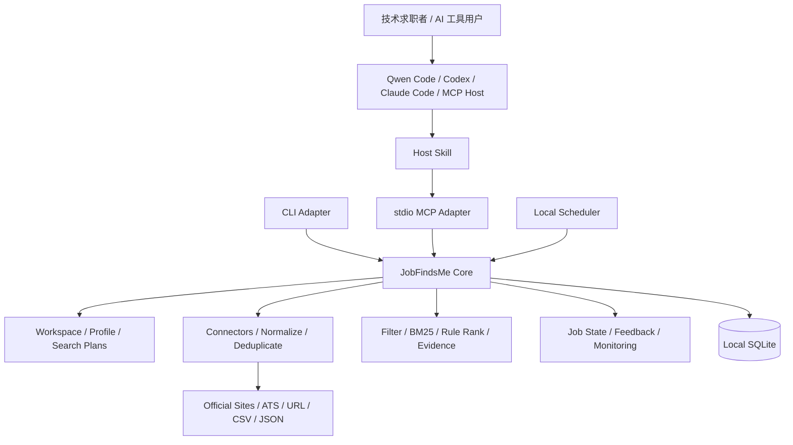

# JobFindsMe Product And Architecture Specification

> Status: v0.2.0-rc.5 release candidate
>
> Baseline: Agent-native, Local-first
>
> Updated: 2026-07-28 (RC5)

## 1. Product Goal

JobFindsMe 面向技术求职者和 AI 工具用户。用户可以提供本地简历，也可以只用
自然语言描述求职目标，由现有 AI Agent 调用 JobFindsMe，从支持的职位来源中
发现、匹配和跟踪仍在招聘的岗位。

产品不以抓取页数、模型调用数或 Agent 步数作为成功标准，而以用户是否更快发现、
打开、收藏和投递真正合适的岗位作为标准。

一句话定位：

> 面向技术求职者和 AI 工具用户的本地优先职位发现与跟踪引擎。

## 2. V0.2 Scope

V0.2 must provide:

- a local Workspace with one accepted candidate profile;
- multiple Search Plans sharing accepted profile facts;
- local resume parsing with an automatic fast path and optional review;
- Schema.org `JobPosting` URL、CSV、JSON、公开 ATS 和企业官方招聘站
  Connector；
- normalization, versioning, deduplication, freshness, and liveness checks;
- deterministic hard filters, BM25, rule ranking, and match evidence;
- job states and feedback history;
- CLI、本地 `stdio` MCP，以及 Qwen Code、Codex、Claude Code 首批集成；
- 一份区分自动契约测试与真实客户端验证的 Agent 兼容矩阵；
- installer, upgrade, uninstall, and doctor commands;
- reproducible offline evaluation;
- optional local scheduling and Feishu summaries after the interactive flow is
  proven.
- zero-ID first use: Core resolves a default Workspace and active Search Plan;
- accepted profile facts participate in every match score and explanation;
- Search Plans persist source subscriptions used by interactive and scheduled runs;
- MCP returns bounded summaries by default and treats job content as untrusted data;
- salary keeps raw text and normalized annual values without inventing missing data.

V0.2 explicitly excludes:

- a public Web application, accounts, cloud database, or multi-tenancy;
- automatic applications or bypassing login and anti-bot controls;
- a custom agent runtime;
- mandatory model APIs, vector databases, Redis, or hosted queues;
- remote synchronization or guaranteed 24-hour monitoring.

The existing Web implementation is an archived prototype, not a dependency of
this repository.

满足以下条件的客户端才进入官方支持列表：

- 能启动或连接本地 MCP Server；
- 支持当前严格 JSON Schema；
- 能正确展示结构化岗位和错误结果；
- 能执行敏感工具的交互流程；
- 通过同一套端到端兼容测试。

## 3. Product Principles

1. Job truth and liveness come before match scores.
2. Agent handles understanding and interaction; Core handles facts, state,
   authorization, and execution.
3. Every adapter calls the same Core and contains no business rules.
4. No API key means the complete deterministic workflow still works.
5. Resume content stays local by default and is minimized after parsing.
6. Metrics come from versioned evaluation scripts.
7. Security cannot depend on a host agent or MCP client's optional behavior.

## 4. Main User Flow

```text
Install JobFindsMe
-> ask an existing agent to find jobs
-> agent passes the resume path to setup_profile
-> Core parses locally and returns a minimal profile summary
-> agent asks only for search-changing missing constraints
-> search_jobs discovers, normalizes, filters, ranks, and explains jobs
-> user opens, saves, dismisses, or marks an application state
-> optional local monitor checks for new jobs while the computer is online
```

If an agent sandbox cannot access the resume path:

```text
jobfindsme profile import /path/to/resume.pdf
-> facts are accepted locally by default
-> the agent continues from the minimal summary
```

## 5. Architecture



Dependency direction:

```text
CLI / MCP / Scheduler / Future Viewer
                 |
                 v
             Core API
                 |
                 v
     Domain + Storage Interfaces
```

Core must not import FastAPI, MCP SDKs, agent SDKs, or UI packages.

## 6. Local Data Model

```text
Workspace
|- CandidateProfile
|  |- SourceDocument
|  `- ProfileFacts
|- SearchPlan A
|- SearchPlan B
|- Jobs and JobVersions
|- MatchEvidence
|- FeedbackEvents and JobState
`- MonitorRuns and JobStateEvents
```

The V0.2 implementation is local-only, but every personal record carries a
`workspace_id` so ownership is explicit and future migration does not require
rewriting the domain.

Profile facts may be shared across plans. Role, location, salary, experience,
source policy, and exclusions belong to a Search Plan.

Job feedback uses both:

- append-only events for history, undo, and evaluation;
- a current-state projection for fast display.

## 7. Resume Privacy

The Skill must instruct the host:

> Do not read or copy the complete resume. Pass its local path to
> `setup_profile`; JobFindsMe will parse it locally.

Import modes:

- `reference`: read the source path, retain its hash and accepted facts;
- `managed`: copy the original into a private local directory with consent;
- `forget-source`: remove temporary text and managed source after profile
  confirmation.

The default workflow parses locally, accepts evidence-grounded facts for the
first search, removes temporary full text, and retains only the hash, accepted
facts, and minimum evidence snippets. Users can request paginated review and
correction before or after the first search.

API keys and notification credentials belong in the operating-system keychain
or an equivalent secret store, never in `config.toml`, logs, or Git.

## 8. Destructive Operation Safety

Host approval is useful but insufficient. Core deletion uses a mandatory
two-phase protocol:

```text
preview
-> calculate exact scope
-> create short-lived, single-use confirmation token
-> change no user data

confirm + token
-> verify token hash, workspace, scope, expiry, and unused state
-> delete selected data and derived indexes
-> invalidate token
-> write a non-PII deletion audit record
```

## 9. Model Capability Layers

### Deterministic Core

No model is required for importing, normalizing, deduplicating, checking
freshness, hard filtering, BM25, rule ranking, job states, or monitoring.

### Host Agent Enhancement

The existing agent can interpret fuzzy intent, ask questions, compare jobs, and
explain skill gaps from structured Core output. Core cannot assume access to the
host model.

### Optional BYOK

With explicit configuration, Core may use a provider abstraction for semantic
reranking, extraction fallback, JD completion, or monitor-time semantic checks.
Every enhancement needs an offline baseline and a measurable gain.

## 10. MCP Surface

The MCP surface exposes high-level user capabilities. Tool count is not a product
constraint:

```text
setup_profile
configure_search
search_jobs
get_jobs
get_job_details
update_job_state
configure_monitor
export_local_data
delete_local_data
```

Discovery, normalization, deduplication, ranking, and evidence construction are
internal Core steps, not separate tools the host must orchestrate.

`workspace_id` and `plan_id` are optional adapter-level escape hatches. Normal
users never manage them: the Core creates a default Workspace and remembers the
active Search Plan. `configure_search` creates or updates that plan and persists
its source subscriptions.

`search_jobs` and `get_jobs` return bounded `JobSummary` records. Full external
job descriptions are untrusted content and are returned only by an explicit,
single-job `get_job_details` call. `export_local_data` writes a local file and
returns only its path, hash, and record counts.

Every job summary separates two classification dimensions:

```text
recruitment_track: campus | social | unknown
employment_type: internship | full_time | part_time | contract | unknown
```

Source-provided fields take precedence over conservative title/JD inference.
Unknown values remain `unknown`; the system must not describe an unknown role as
a formal full-time role. Human-facing job lists use one stable block per job:

```text
1. 岗位名称｜公司｜地点｜校招/社招/未注明｜实习/正式/未注明
   投递链接：https://...
```

The text view is for scanning. Structured MCP output retains the job ID, score,
evidence, typed classifications, and URL for subsequent Agent actions.

Browser-backed sources are never part of implicit discovery. Default searches
use HTTP/ATS connectors only. SPA Playwright and BOSS CDP sources require an
explicit per-search opt-in; persisted legacy subscriptions do not override this
runtime safety boundary. Playwright uses its managed Chromium and never falls
back to the user's everyday Google Chrome application.

`delete_local_data` accepts either:

```json
{"action": "preview", "scope": "workspace"}
```

or:

```json
{
  "action": "confirm",
  "scope": "workspace",
  "confirmation_token": "short-lived-token"
}
```

## 11. Source Strategy

### 11.1 中国招聘渠道的真实格局

国内企业招聘以 BOSS直聘/猎聘/智联/拉勾为主，官网为辅。只有 BAT/字节等少数大厂以官网为主要入口。

JobFindsMe 两条腿走路：
- **官网/ATS Connector**：对以官网为主的企业，建立直连（百度、腾讯、字节、美团、滴滴、B站、Airbnb、Airwallex）
- **平台 CDP Connector**：对招聘平台，用户在自己的浏览器登录一次，CDP 桥自动调取岗位

### 11.2 自动 Connector（12 个）

| 来源 | 类型 | 技术 |
|------|------|------|
| 百度、腾讯 | 官网直连 | SSR / JSON-LD |
| 字节、美团、滴滴、B站 | 官网直连 | Playwright SPA |
| BOSS直聘、猎聘、智联、拉勾 | 平台 CDP | Chrome 浏览器桥 |
| Airbnb、Airwallex | ATS API | Greenhouse / Ashby |

BOSS + 猎聘 + 智联 + 拉勾四个平台覆盖阿里、华为、京东、网易、拼多多、小红书、快手、小米、携程、蚂蚁、联想等所有中国大厂，以及几千家中小企业。不需要手动链接。

### 11.3 平台接入原则

- 用户在自己的浏览器中登录，JobFindsMe 不接触凭据
- CDP 连接只提取用户已登录可见的岗位信息
- 不绕过登录、验证码、反爬限制或平台条款
- `jobfindsme boss-setup` 一键启动隔离 Chrome，同时打开四个平台登录页

1. **自动 Connector**：企业官网有公开数据接口 → 直接抓取，用户零操作
2. **浏览器桥**：平台需登录 → 用户授权后，本地扩展协助提取
3. **直达链接**：无法自动接入 → 提供一键搜索链接，用户手动浏览
4. **用户导入**：URL / CSV / JSON → 用户主动提供

链接入口和 Connector 必须明确区分，不能把”可打开”宣传成”已抓取”。

### 11.4 Agent Compatibility Strategy

官方集成按以下顺序推进：

```text
P0: ZCode、Codex、Claude Code、Qwen Code
P1: Cherry Studio、Cursor、Cline、Roo Code、OpenCode
P2: 其他符合 MCP stdio 与工具 Schema 的客户端
```

每个客户端都必须经过相同场景：本地画像（不读完整简历）、搜索配置、岗位匹配、状态管理、导出、两阶段删除、故障时退回 CLI。

## 12. Delivery Milestones

1. Product and architecture baseline.
2. Local Workspace, Search Plans, and resume lifecycle.
3. Official-source discovery, deterministic matching, and offline evaluation.
4. Product-grade CLI and local stdio MCP Server.
5. Agent integrations and an evidence-based compatibility matrix.
6. One-command install, upgrade, uninstall, and doctor.
7. Initial real official-source validation.
8. Local scheduler and signed Feishu summaries.
9. Release hardening and clean-environment package validation.
10. Zero-ID onboarding and profile-grounded matching.
11. Subscription-backed discovery monitoring and source health.
12. Bounded MCP output, redirect-safe HTTP, and regional data contracts.
13. Enterprise career-site connectors and China source catalog.
14. Real Chinese job matching evidence: 50+ labeled jobs across 3+ days of
    real use, script-generated metrics, and qualitative evidence.
15. Personal field trial across at least two Agent hosts.
16. SPA Connector contract tests, browser diagnostics, and live source reports.
17. BOSS CDP bridge hardening; keep experimental until a logged-in field test.
18. Schema-aware migration reconciliation.
19. RC5 release truth, documentation alignment, and community onboarding.

## 13. Definition Of Done

A feature is done only when:

- its acceptance criteria are executable;
- deterministic unit and integration tests pass;
- failure and privacy behavior is covered;
- Core remains independent from adapters;
- evidence is recorded under `reports/features`;
- documentation and the machine task list agree.
