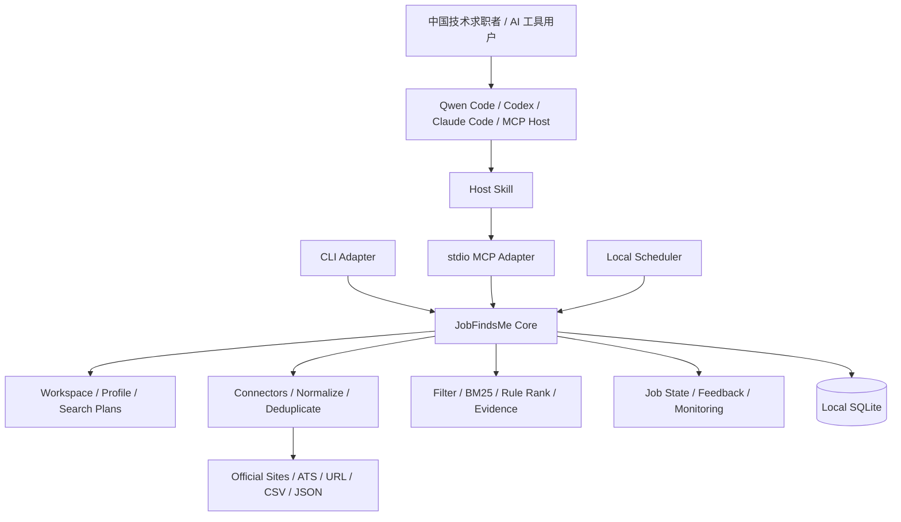

# JobFindsMe Product And Architecture Specification

> Status: executable product baseline
>
> Baseline: Agent-native, Local-first
>
> Updated: 2026-07-28

## 1. Product Goal

JobFindsMe 首先服务中国的技术求职者和 AI 工具用户。用户可以提供本地简历，
也可以只用自然语言描述求职目标，由现有 AI Agent 调用 JobFindsMe，在合规、
授权和来源可访问的范围内，从企业招聘官网、公开 ATS、招聘平台公开接口及用户
主动导入的数据中发现、匹配和跟踪仍在招聘的岗位。

产品不以抓取页数、模型调用数或 Agent 步数作为成功标准，而以用户是否更快发现、
打开、收藏和投递真正合适的岗位作为标准。

一句话定位：

> 面向中国技术求职者和 AI 工具用户的本地优先职位发现与跟踪引擎，让现有
> AI Agent 根据本地简历或描述，找到真正值得投递的岗位。

## 2. V0.1 Scope

V0.1 must provide:

- a local Workspace with one confirmed candidate profile;
- multiple Search Plans sharing confirmed profile facts;
- local resume parsing with evidence and explicit corrections;
- URL、CSV、JSON、公开 ATS 和一个中国企业官方招聘站 Connector；
- normalization, versioning, deduplication, freshness, and liveness checks;
- deterministic hard filters, BM25, rule ranking, and match evidence;
- job states and feedback history;
- CLI、本地 `stdio` MCP，以及 Qwen Code、Codex、Claude Code 首批集成；
- 一份经过真实测试的主流 Agent 兼容矩阵；
- installer, upgrade, uninstall, and doctor commands;
- reproducible offline evaluation;
- optional local scheduling and Feishu summaries after the interactive flow is
  proven.

V0.1 explicitly excludes:

- a public Web application, accounts, cloud database, or multi-tenancy;
- automatic applications or bypassing login and anti-bot controls;
- a custom agent runtime;
- mandatory model APIs, vector databases, Redis, or hosted queues;
- remote synchronization or guaranteed 24-hour monitoring.

The existing Web implementation is an archived prototype, not a dependency of
this repository.

“兼容所有知名 Agent”是协议和测试目标，不是未经验证的宣传。满足以下条件的
客户端才进入官方支持列表：

- 能启动或连接本地 MCP Server；
- 支持当前严格 JSON Schema；
- 能正确展示结构化岗位和错误结果；
- 能执行敏感工具的交互流程；
- 通过同一套端到端兼容测试。

## 3. Product Principles

1. Job truth and liveness come before match scores.
2. Agent handles understanding and interaction; Core handles facts, state,
   authorization, and execution.
3. Every adapter calls the same Core and contains no business rules.
4. No API key means the complete deterministic workflow still works.
5. Resume content stays local by default and is minimized after confirmation.
6. Metrics come from versioned evaluation scripts.
7. Security cannot depend on a host agent or MCP client's optional behavior.

## 4. Main User Flow

```text
Install JobFindsMe
-> ask an existing agent to find jobs
-> agent passes the resume path to setup_profile
-> Core parses locally and returns a minimal profile summary
-> agent asks only for search-changing missing constraints
-> search_jobs discovers, normalizes, filters, ranks, and explains jobs
-> user opens, saves, dismisses, or marks an application state
-> optional local monitor checks for new jobs while the computer is online
```

If an agent sandbox cannot access the resume path:

```text
jobfindsme profile import /path/to/resume.pdf
-> confirm the local profile
-> the agent reads only the confirmed summary
```

## 5. Architecture



Dependency direction:

```text
CLI / MCP / Scheduler / Future Viewer
                 |
                 v
             Core API
                 |
                 v
     Domain + Storage Interfaces
```

Core must not import FastAPI, MCP SDKs, agent SDKs, or UI packages.

## 6. Local Data Model

```text
Workspace
|- CandidateProfile
|  |- SourceDocument
|  `- ProfileFacts
|- SearchPlan A
|- SearchPlan B
|- Jobs and JobVersions
|- MatchEvidence
|- FeedbackEvents and JobState
`- SearchRuns and ConnectorRuns
```

The V0.1 implementation is local-only, but every personal record carries a
`workspace_id` so ownership is explicit and future migration does not require
rewriting the domain.

Profile facts may be shared across plans. Role, location, salary, experience,
source policy, and exclusions belong to a Search Plan.

Job feedback uses both:

- append-only events for history, undo, and evaluation;
- a current-state projection for fast display.

## 7. Resume Privacy

The Skill must instruct the host:

> Do not read or copy the complete resume. Pass its local path to
> `setup_profile`; JobFindsMe will parse it locally.

Import modes:

- `reference`: read the source path, retain its hash and confirmed facts;
- `managed`: copy the original into a private local directory with consent;
- `forget-source`: remove temporary text and managed source after profile
  confirmation.

The default workflow parses locally, extracts evidence-grounded facts, asks the
user to confirm them, removes temporary full text, and retains only the hash,
confirmed facts, and minimum evidence snippets.

API keys and notification credentials belong in the operating-system keychain
or an equivalent secret store, never in `config.toml`, logs, or Git.

## 8. Destructive Operation Safety

Host approval is useful but insufficient. Core deletion uses a mandatory
two-phase protocol:

```text
preview
-> calculate exact scope
-> create short-lived, single-use confirmation token
-> change no user data

confirm + token
-> verify token hash, workspace, scope, expiry, and unused state
-> delete selected data and derived indexes
-> invalidate token
-> write a non-PII deletion audit record
```

## 9. Model Capability Layers

### Deterministic Core

No model is required for importing, normalizing, deduplicating, checking
freshness, hard filtering, BM25, rule ranking, job states, or monitoring.

### Host Agent Enhancement

The existing agent can interpret fuzzy intent, ask questions, compare jobs, and
explain skill gaps from structured Core output. Core cannot assume access to the
host model.

### Optional BYOK

With explicit configuration, Core may use a provider abstraction for semantic
reranking, extraction fallback, JD completion, or monitor-time semantic checks.
Every enhancement needs an offline baseline and a measurable gain.

## 10. MCP Surface

V0.1 exposes seven high-level tools:

```text
setup_profile
search_jobs
get_jobs
update_job_state
configure_monitor
export_local_data
delete_local_data
```

Discovery, normalization, deduplication, ranking, and evidence construction are
internal Core steps, not separate tools the host must orchestrate.

`delete_local_data` accepts either:

```json
{"action": "preview", "scope": "all"}
```

or:

```json
{
  "action": "confirm",
  "scope": "all",
  "confirmation_token": "short-lived-token"
}
```

## 11. Source Strategy

First release source portfolio:

- single job URL;
- CSV and JSON imports;
- one generic public ATS connector;
- one Chinese company official-career-site connector.

岗位来源分为四个接入等级：

1. 企业招聘官网和公开 ATS：默认优先，直接建立 Connector。
2. 招聘平台公开页面或官方开放接口：按平台条款、频率和字段许可接入。
3. 用户主动提供的岗位 URL、CSV、JSON 或平台导出文件：本地解析。
4. 需要登录的平台：未来仅考虑由用户主动授权的本地浏览器桥接，不上传账号凭据，
   不代替用户绕过确认步骤。

第一版中国专用来源必须无需登录、岗位详情页稳定、包含发布日期或可验证的新鲜度
信号、提供明确投递链接，并有足够活跃岗位支持重复测试。

BOSS直聘、猎聘、智联招聘等招聘 App 不因产品定位而自动成为可抓取数据源。
只有存在公开接口、公开页面、用户导出或合法授权链路时才接入。JobFindsMe 不保存
招聘平台账号密码，不绕过登录、验证码、反爬限制、robots规则或平台条款。

### 11.1 Agent Compatibility Strategy

官方集成按以下顺序推进：

```text
P0: Qwen Code、Codex、Claude Code
P1: Cherry Studio、Cursor、Cline、Roo Code、OpenCode
P2: 其他符合 MCP stdio 与工具 Schema 的客户端
```

每个客户端都必须经过相同场景：

- 通过本地路径建立画像，但宿主模型不读取完整简历；
- 从自然语言生成或选择 SearchPlan；
- 搜索、查看和解释岗位；
- 收藏、忽略和更新投递状态；
- 导出数据；
- 执行两阶段删除且不能跳过 Core 校验；
- MCP故障时明确提示用户退回CLI。

## 12. Delivery Milestones

1. Product and architecture baseline.
2. Local Workspace and multiple Search Plans.
3. Core API independent from FastAPI.
4. Product-grade CLI adapter.
5. Local stdio MCP Server.
6. Qwen Code、Codex、Claude Code integrations and compatibility suite.
7. One-command install, upgrade, uninstall, and doctor.
8. End-to-end validation with real official career-site jobs.
9. Local scheduler and Feishu summaries.

A dedicated JobFindsMe Agent is considered only after at least three stable
sources, repeat usage, real feedback, and a demonstrated limitation in existing
agent hosts.

## 13. Definition Of Done

A feature is done only when:

- its acceptance criteria are executable;
- deterministic unit and integration tests pass;
- failure and privacy behavior is covered;
- Core remains independent from adapters;
- evidence is recorded under `reports/features`;
- documentation and the machine task list agree.
