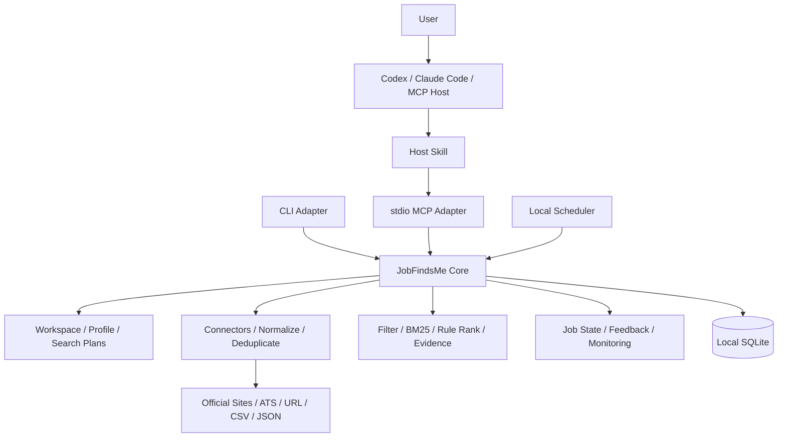

# JobFindsMe Product And Architecture Specification

> Status: executable product baseline
>
> Baseline: Agent-native, Local-first
>
> Updated: 2026-07-28

## 1. Product Goal

JobFindsMe helps a job seeker use an existing agent to discover, match, and
track currently open jobs from official sources with minimal time and input.

Success is measured by qualified jobs the user chooses to open, save, or apply
to, not by the number of scraped pages, model calls, or agent steps.

## 2. V0.1 Scope

V0.1 must provide:

- a local Workspace with one confirmed candidate profile;
- multiple Search Plans sharing confirmed profile facts;
- local resume parsing with evidence and explicit corrections;
- URL, CSV, JSON, public ATS, and one Chinese official-site connector;
- normalization, versioning, deduplication, freshness, and liveness checks;
- deterministic hard filters, BM25, rule ranking, and match evidence;
- job states and feedback history;
- CLI, local stdio MCP, Codex Skill, and Claude Code Skill;
- installer, upgrade, uninstall, and doctor commands;
- reproducible offline evaluation;
- optional local scheduling and Feishu summaries after the interactive flow is
  proven.

V0.1 explicitly excludes:

- a public Web application, accounts, cloud database, or multi-tenancy;
- automatic applications or bypassing login and anti-bot controls;
- a custom agent runtime;
- mandatory model APIs, vector databases, Redis, or hosted queues;
- remote synchronization or guaranteed 24-hour monitoring.

The existing Web implementation is an archived prototype, not a dependency of
this repository.

## 3. Product Principles

1. Job truth and liveness come before match scores.
2. Agent handles understanding and interaction; Core handles facts, state,
   authorization, and execution.
3. Every adapter calls the same Core and contains no business rules.
4. No API key means the complete deterministic workflow still works.
5. Resume content stays local by default and is minimized after confirmation.
6. Metrics come from versioned evaluation scripts.
7. Security cannot depend on a host agent or MCP client's optional behavior.

## 4. Main User Flow

```text
Install JobFindsMe
-> ask an existing agent to find jobs
-> agent passes the resume path to setup_profile
-> Core parses locally and returns a minimal profile summary
-> agent asks only for search-changing missing constraints
-> search_jobs discovers, normalizes, filters, ranks, and explains jobs
-> user opens, saves, dismisses, or marks an application state
-> optional local monitor checks for new jobs while the computer is online
```

If an agent sandbox cannot access the resume path:

```text
jobfindsme profile import /path/to/resume.pdf
-> confirm the local profile
-> the agent reads only the confirmed summary
```

## 5. Architecture



Dependency direction:

```text
CLI / MCP / Scheduler / Future Viewer
                 |
                 v
             Core API
                 |
                 v
     Domain + Storage Interfaces
```

Core must not import FastAPI, MCP SDKs, agent SDKs, or UI packages.

## 6. Local Data Model

```text
Workspace
|- CandidateProfile
|  |- SourceDocument
|  `- ProfileFacts
|- SearchPlan A
|- SearchPlan B
|- Jobs and JobVersions
|- MatchEvidence
|- FeedbackEvents and JobState
`- SearchRuns and ConnectorRuns
```

The V0.1 implementation is local-only, but every personal record carries a
`workspace_id` so ownership is explicit and future migration does not require
rewriting the domain.

Profile facts may be shared across plans. Role, location, salary, experience,
source policy, and exclusions belong to a Search Plan.

Job feedback uses both:

- append-only events for history, undo, and evaluation;
- a current-state projection for fast display.

## 7. Resume Privacy

The Skill must instruct the host:

> Do not read or copy the complete resume. Pass its local path to
> `setup_profile`; JobFindsMe will parse it locally.

Import modes:

- `reference`: read the source path, retain its hash and confirmed facts;
- `managed`: copy the original into a private local directory with consent;
- `forget-source`: remove temporary text and managed source after profile
  confirmation.

The default workflow parses locally, extracts evidence-grounded facts, asks the
user to confirm them, removes temporary full text, and retains only the hash,
confirmed facts, and minimum evidence snippets.

API keys and notification credentials belong in the operating-system keychain
or an equivalent secret store, never in `config.toml`, logs, or Git.

## 8. Destructive Operation Safety

Host approval is useful but insufficient. Core deletion uses a mandatory
two-phase protocol:

```text
preview
-> calculate exact scope
-> create short-lived, single-use confirmation token
-> change no user data

confirm + token
-> verify token hash, workspace, scope, expiry, and unused state
-> delete selected data and derived indexes
-> invalidate token
-> write a non-PII deletion audit record
```

## 9. Model Capability Layers

### Deterministic Core

No model is required for importing, normalizing, deduplicating, checking
freshness, hard filtering, BM25, rule ranking, job states, or monitoring.

### Host Agent Enhancement

The existing agent can interpret fuzzy intent, ask questions, compare jobs, and
explain skill gaps from structured Core output. Core cannot assume access to the
host model.

### Optional BYOK

With explicit configuration, Core may use a provider abstraction for semantic
reranking, extraction fallback, JD completion, or monitor-time semantic checks.
Every enhancement needs an offline baseline and a measurable gain.

## 10. MCP Surface

V0.1 exposes seven high-level tools:

```text
setup_profile
search_jobs
get_jobs
update_job_state
configure_monitor
export_local_data
delete_local_data
```

Discovery, normalization, deduplication, ranking, and evidence construction are
internal Core steps, not separate tools the host must orchestrate.

`delete_local_data` accepts either:

```json
{"action": "preview", "scope": "all"}
```

or:

```json
{
  "action": "confirm",
  "scope": "all",
  "confirmation_token": "short-lived-token"
}
```

## 11. Source Strategy

First release source portfolio:

- single job URL;
- CSV and JSON imports;
- one generic public ATS connector;
- one Chinese company official-career-site connector.

The Chinese source must require no login, have stable detail pages, expose an
official apply URL, and provide enough active jobs for repeatable validation.
JobFindsMe does not bypass authentication, CAPTCHA, robots controls, or platform
terms.

## 12. Delivery Milestones

1. Product and architecture baseline.
2. Local Workspace and multiple Search Plans.
3. Core API independent from FastAPI.
4. Product-grade CLI adapter.
5. Local stdio MCP Server.
6. Codex and Claude Code Skills.
7. One-command install, upgrade, uninstall, and doctor.
8. End-to-end validation with real official career-site jobs.
9. Local scheduler and Feishu summaries.

A dedicated JobFindsMe Agent is considered only after at least three stable
sources, repeat usage, real feedback, and a demonstrated limitation in existing
agent hosts.

## 13. Definition Of Done

A feature is done only when:

- its acceptance criteria are executable;
- deterministic unit and integration tests pass;
- failure and privacy behavior is covered;
- Core remains independent from adapters;
- evidence is recorded under `reports/features`;
- documentation and the machine task list agree.
