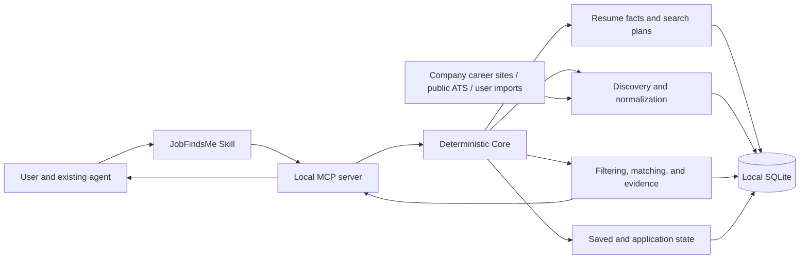

# JobFindsMe

**Let the AI agent you already use discover, filter, and track jobs from a local resume.**

[](https://github.com/russeell/jobfindsme/actions/workflows/ci.yml)
[](https://www.python.org/)
[](https://modelcontextprotocol.io/)
[](https://github.com/russeell/jobfindsme/releases)
[](LICENSE)

[中文](README.md) | [Quick start](#quick-start) | [How it works](#how-it-works) | [Sources](#supported-sources) | [Contributing](#contributing)

JobFindsMe is a **local-first, agent-native** job discovery and tracking engine. It is not another job board and it does not mass-apply on your behalf. A deterministic local Core owns resume parsing, discovery, deduplication, filtering, evidence matching, and state. Codex, Claude Code, Qwen Code, or another MCP host handles natural-language interaction and result explanation.

```text
You: Use ~/Documents/resume.pdf to find AI application engineer roles
     in Shanghai or Hangzhou for 0–3 years of experience.
     Prefer official company sources and exclude outsourcing.

Agent + JobFindsMe:
1. Parse locally, accept structured facts by default, and keep review optional
2. Configure the search and select maintained sources
3. Filter jobs by role family, location, seniority, and other constraints
4. Return evidence, gaps, status, and official application links
5. Remember saved, rejected, and applied jobs across agent sessions
```

> The current release is [`v0.2.0-rc.3`](https://github.com/russeell/jobfindsme/releases/tag/v0.2.0-rc.3). It fixes packaged migrations, MCP list responses, and the first-use path, but remains a release candidate. Real-world Chinese job relevance is being validated through human labels and continued use.

## Why JobFindsMe

- **Bring your existing agent.** No new chat UI and no mandatory model API.
- **Keep state local.** Resume facts, search plans, saved jobs, and application state live in local SQLite.
- **Work without an API key.** Collection, normalization, deduplication, hard filters, and baseline ranking are deterministic.
- **Require evidence.** Skill-based reasons connect confirmed resume facts to job-description evidence.
- **Discover, do not auto-apply.** The user always decides whether to open and submit an application.
- **State source capability honestly.** Automated connectors, official search links, and user imports are separate concepts.

## Quick Start

### 1. Install

Python 3.11 or later is required.

```bash
python3 -m pip install \
  "jobfindsme @ git+https://github.com/russeell/jobfindsme.git@v0.2.0-rc.3"
jobfindsme doctor
```

### 2. Connect an agent

```bash
jobfindsme install codex
# Or:
jobfindsme install claude
jobfindsme install qwen
```

The installer registers the local `stdio` MCP server, installs the JobFindsMe Skill, creates the private local data directory, and backs up modified host configuration.

Restart the agent and ask:

```text
Use JobFindsMe with ~/Documents/resume.pdf.
Find AI application engineer or agent engineer roles in Shanghai and Hangzhou.
Target 0–3 years and 20–40K CNY per month. Exclude outsourcing.
```

Workspace and Search Plan IDs are internal. Users do not create, copy, or manage them.

### 3. Diagnose a problem

```bash
jobfindsme doctor
jobfindsme --help
```

The CLI is also the fallback for environments where MCP integration or local-path access is unavailable.

## How It Works



The boundary is deliberate:

> **The agent owns understanding and interaction. The Core owns facts, state, and execution.**

Agents and models can change without trapping the user's profile, plans, or application history inside a conversation.

### Search pipeline

```text
Local resume path
→ Local parsing with default acceptance and optional grouped review
→ Search Plan and source subscriptions
→ Discovery, normalization, and cross-source deduplication
→ Role, location, salary, experience, and exclusion filters
→ Resume-to-JD evidence matching
→ Bounded summaries and official application links
→ Saved / rejected / applied states
→ Optional local monitoring and Feishu notifications
```

## Capabilities

| Capability | Current implementation |
|---|---|
| Local profile | Parse PDF, DOCX, Markdown, and text; use the fast default or review and correct facts first |
| Multiple Search Plans | Separate role, city, salary, experience, and exclusion criteria |
| Discovery | Connectors, official links, single-job URLs, CSV, and JSON |
| Eligibility | Role family, location, salary, experience, exclusions, and seniority |
| Evidence matching | Resume evidence, JD evidence, matches, gaps, and warnings |
| Source governance | Normalization, source records, fingerprints, deduplication, freshness |
| Job state | Saved, rejected, applied, and state history |
| Monitoring | Rediscover sources, compare history, notify only on new matches |
| Agent integration | Codex, Claude Code, Qwen Code, and MCP-compatible hosts |
| Local operations | CLI, install, upgrade, uninstall, doctor, export, two-step deletion |

## Supported Sources

Being able to open an official link is not the same as automatically parsing it. JobFindsMe uses explicit source tiers.

### Automated connectors

| Source | Capability | Status |
|---|---|---|
| Baidu Careers | Search public jobs and emit official detail links | Available; currently reads the first server-rendered result page |
| Greenhouse Job Board | Read public jobs through the official board API | Available |
| Ashby Job Board | Read jobs through its public endpoint | Available |
| Airwallex China jobs | Uses the Ashby connector | Initial snapshot validated |
| Schema.org `JobPosting` | Parse a public single-job page | Available |
| CSV / JSON | Import user-owned or lawfully obtained data | Available |

### Official live links

JobFindsMe can direct the user or host agent to official company and recruitment-platform searches. It does **not** bypass login, CAPTCHA, access controls, or anti-bot systems to scrape Huawei, Tencent, ByteDance, BOSS Zhipin, Liepin, Zhaopin, or 51job.

New sources should prefer public APIs, public server-rendered data, or stable company career pages and must comply with the target site's terms.

## MCP Tools

JobFindsMe exposes nine typed tools:

| Tool | Purpose |
|---|---|
| `setup_profile` | Import and accept local facts by default, with paginated review and correction |
| `configure_search` | Create or update the active search |
| `search_jobs` | Discover from sources and run matching |
| `get_jobs` | Read bounded, paginated job summaries |
| `get_job_details` | Read one explicitly requested job |
| `update_job_state` | Save, reject, or mark a job as applied |
| `configure_monitor` | Configure local monitoring |
| `export_local_data` | Export locally and return only path, hash, and counts |
| `delete_local_data` | Preview deletion, then confirm with a short-lived token |

## Privacy and Safety

- The host agent should pass a **resume path** instead of reading or copying the full document.
- The default mode keeps structured facts and necessary evidence, not a long-lived resume copy.
- The fast path accepts parsed facts for immediate matching; users can request review, correction, or re-import.
- Job descriptions are untrusted external content. Tools return bounded summaries and short evidence by default.
- Full descriptions require an explicit single-job request.
- Exports are written locally; the tool returns only path, hash, and record counts.
- Core enforces preview plus a short-lived confirmation token for deletion, independent of host approval support.
- HTTP redirects are validated hop by hop; private, local, and credential-bearing URLs are rejected.

JobFindsMe cannot guarantee that every third-party page is safe, every job is active, or every recommendation is correct. Verify the company, role, and official link before applying.

## Current Validation

`v0.2.0-rc.3` has passed:

- 129 automated tests;
- GitHub Actions on Python 3.11 and 3.12;
- Ruff lint and format checks;
- clean wheel installation and installed-package doctor checks;
- installed database migration and MCP empty-result smoke checks;
- a temporary Baidu China AI job end-to-end trial;
- an Airwallex public-source snapshot trial.

Evidence lives in [`reports/`](reports/).

These results show that the engineering path executes. They do **not** prove production recommendation quality. Synthetic data is regression evidence only; Precision@10, NDCG@10, valid-link rate, and related product metrics require human labels on real jobs.

## Current Limitations

- This is a release candidate and should not be the user's only job-search channel.
- Automated China connectors remain limited; major recruitment platforms are currently official search links.
- Chinese role, location, salary, and experience normalization need more real-world samples.
- The Baidu connector currently processes the first server-rendered result page.
- Local monitoring requires the user's device or scheduler environment to remain available.
- There is no public Web service, cloud account system, or automatic job application.

## Roadmap

- [x] Local workspace, profile, Search Plans, and job state
- [x] CLI, `stdio` MCP server, and Agent Skill
- [x] Subscriptions, rediscovery, cached degradation, and Feishu notifications
- [x] Resume Parser V3 and AI-role eligibility gate
- [ ] Human-labeled Chinese job benchmark
- [ ] Seven-day real job-search field trial and Bad Case report
- [ ] More maintainable Chinese company career-site connectors
- [ ] Broader Chinese role, location, salary, and experience normalization
- [ ] Connector health monitoring and a community source catalog

See [`PROJECT_SPEC.md`](PROJECT_SPEC.md) for the product boundary and architecture.

## Development

```bash
git clone https://github.com/russeell/jobfindsme.git
cd jobfindsme
python3 -m venv .venv
source .venv/bin/activate
python -m pip install -e ".[dev]"

python -m pytest
ruff check .
ruff format --check .
```

CI runs the same gates on Python 3.11 and 3.12.

## Contributing

The most valuable contributions make real job searches more reliable:

- anonymized false-positive, false-negative, duplicate, or expired-job cases;
- maintainable and compliant company career-site connectors;
- Chinese role aliases, locations, salary formats, and experience samples;
- Agent Skill, installer compatibility, and privacy improvements;
- deterministic fixtures, parser tests, and source documentation for each connector.

Open an [Issue](https://github.com/russeell/jobfindsme/issues) describing the source, its public access method, expected fields, and validation plan before implementing a connector. Never commit account cookies, access tokens, resumes, or other private data.

## License

[MIT](LICENSE)
