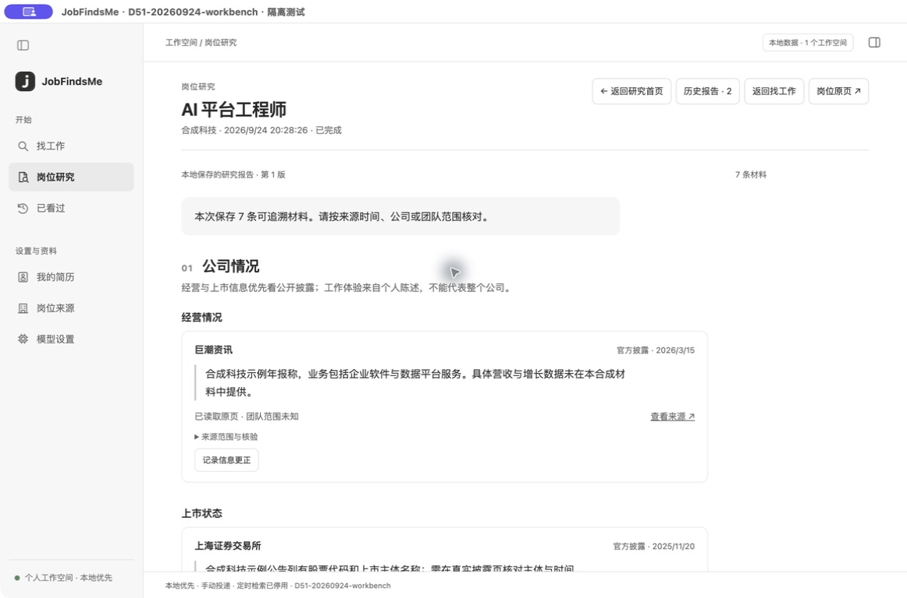

# JobFindsMe

**Find a promising role. Learn more about the company before you apply.**

JobFindsMe is a local desktop workspace for job search, role research and resume maintenance. Browse results alongside the original hiring website, save interesting roles, and investigate the opportunities you want to pursue.

[中文](README.md) · [Developer documentation](docs/desktop/README.md)



*Current D51 interface using a synthetic role in an isolated QA profile. It is not a real listing or company review.*

## Find jobs with fewer open windows

Search by role or skill, choose cities, salary ranges and experience requirements, and select the hiring platforms and company websites you want to search. With a confirmed resume, you can leave the keyword blank: the app makes a bounded set of search terms from confirmed skills and experience and shows the terms it used. Set city and salary filters on the search page.

- Select multiple sources, select all, or check their availability.
- Read job details alongside the original page in the embedded browser.
- See when the source does not provide a publication date, salary or complete job description; retrieval time is never presented as publication time.
- Save roles and track read and application status.
- Run searches manually when you want updated listings; historical plans and run records remain stored locally.

You submit applications yourself on the hiring website. Opening a link does not mark a job as applied.

## Research the role before applying

Open a role and use the research composer. Company and role topics are selected by default. Start without typing, or add a question that enters a bounded public web search:

| Direction | What to look for |
| --- | --- |
| **Company context** | Business and listing information, positive and negative accounts, workload and everyday benefits |
| **Role content and development** | The saved job description, responsibilities and skills, considered alongside company business evidence |

Reports keep source links, publication dates and scope. The History button reopens earlier versions. A follow-up searches for evidence related to the question and saves a new version; without direct evidence, the app says it cannot answer. Cancellation or failure leaves the report you were reading in place. Official disclosures are distinguished from personal accounts. Missing evidence remains unknown; development analysis does not promise promotion or rate companies.

## Keep your resume up to date

Import **PDF, DOCX, Markdown or TXT**, review skills and experience, then confirm them for search. Pending imports are not used. You can clear the current resume and continue searching by keyword; historical search and research snapshots remain intact.

Scanned PDFs do not yet support OCR. Convert older DOC files to DOCX first.

## Keep the original website close

The embedded browser supports multiple tabs and retains app-specific login sessions. Websites may still require you to sign in again when sessions expire or verification is needed.

When automated retrieval is unavailable, open the original site and continue browsing. A working webpage does not guarantee successful automated extraction.

The source catalog currently includes **four hiring platforms and sixteen company career sites**. Availability varies; check the status shown in the app.

## Get started

This project is currently a **macOS desktop development build**. To run from source, install Git, Python 3.11+ and Node.js/npm:

```bash
git clone https://github.com/russeell/jobfindsme.git
cd jobfindsme

python3 -m venv .venv
source .venv/bin/activate
python -m pip install -e ".[dev,browser]"

cd apps/desktop
npm ci
npm run build
npm start
```

Choose sources, sign in where needed, then enter a keyword to search. Import and confirm a resume when you want personalized matching. Open a result to read the original listing, save it or research its reputation.

The app defaults to `.venv/bin/python`. Set `JFM_PYTHON` to use another interpreter.

## Things to know

- **Source support is still evolving.** Zhilian's authenticated retrieval has outstanding verification work, and Alibaba job details have known access issues. See the [current status](docs/desktop/HANDOFF.md).
- **Scheduled searches are disabled.** Plans do not run or catch up automatically, and new plans cannot be created or resumed. Historical plans and run records remain stored locally.
- **Local storage is not fully offline operation.** Records, resumes and reports are stored locally. Website searches need network access. Ordinary job search and research do not automatically call a paid model. A free-form question is used as a public web search term; do not include private information.
- **Public accounts are not established facts.** JobFindsMe organizes public information and links without guaranteeing its truth, completeness or representativeness. It does not rate or recommend companies or jobs. Consider the team, role, date and original context.

## For contributors

The desktop uses **Electron, React and TypeScript**; local services and storage use **Python and SQLite**.

[Directory map](docs/desktop/STRUCTURE.md) · [Architecture](docs/desktop/TECHNICAL.md) · [Development](docs/desktop/DEVELOPMENT.md) · [Contributing](CONTRIBUTING.md)

Existing CLI/MCP users can consult the [compatibility documentation](docs/legacy/README.en.md). Those interfaces are not required to use the desktop app.

[Security](SECURITY.md) · [MIT License](LICENSE)
