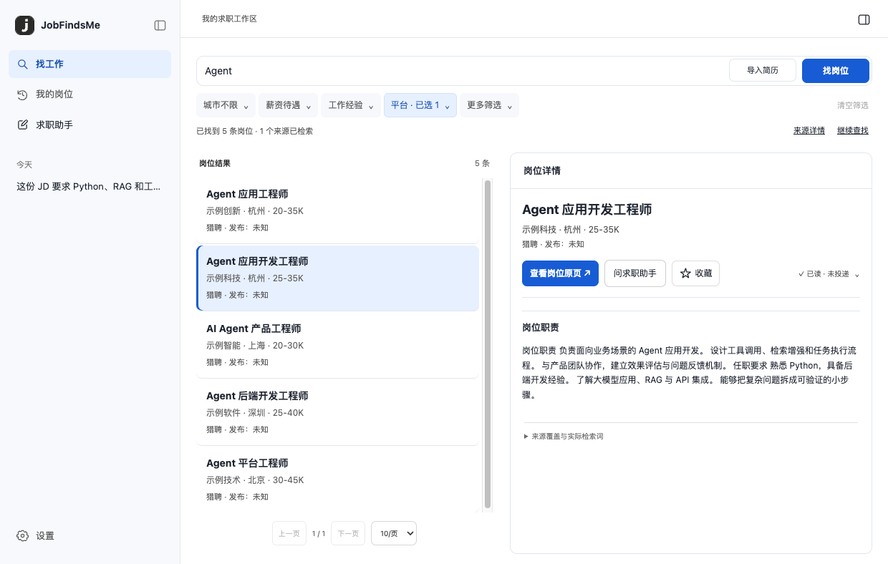
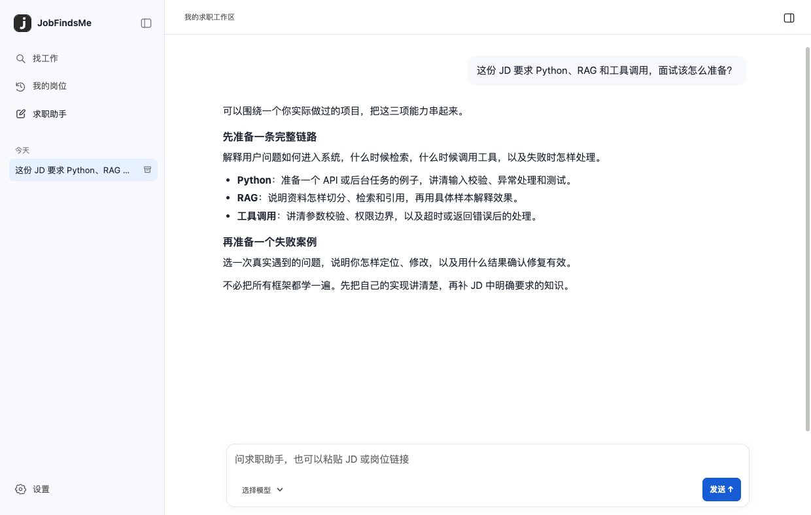

  

<h1 align="center">JobFindsMe</h1>

<strong>Find jobs. Tailor your resume. Practice interviews. Research companies.</strong> Open-source AI job-search desktop assistant · macOS / Windows

  <a href="https://github.com/russeell/jobfindsme/releases/latest/download/mac-arm64.zip">macOS (Apple Silicon)</a> ·
  <a href="https://github.com/russeell/jobfindsme/releases/latest/download/windows-x64.zip">Windows (x64)</a> ·
  <a href="https://github.com/russeell/jobfindsme/issues">Report an issue</a> ·
  <a href="README.md">简体中文</a>

## What it does

| Feature | What you get |
| --- | --- |
| **Search four platforms** | BOSS Zhipin, Liepin, Zhaopin and 51job. Results arrive progressively; filter, continue searching and fetch full job descriptions. **No model needed for job search.** |
| **Tailor your resume** | Draft changes based on the role and your actual experience, then review and save. |
| **Practice interviews** | Preparation, one question at a time, feedback and follow-ups. **A job description is optional.** |
| **Deep research** | Investigate roles, companies and industries with original sources and explicit evidence gaps. |

Save jobs and track applications; search, archive and branch conversations.

Fictional jobs and demo conversations. Coverage depends on sign-in, verification and website changes. Check research conclusions against the original sources.

## Get started

1. **Download and extract**, then open `JobFindsMe.app` or `JobFindsMe.exe`. No separate runtime installation needed.
2. **Choose sources and search**: select platforms in Settings → Job sources, sign in when needed, then enter keywords and choose one city or no city restriction.
3. **Prepare with AI**: configure a model in Settings → Model settings, then select a skill from the assistant's ＋ menu.

Packages are unsigned. First-launch instructions and checksums are on the [release page](https://github.com/russeell/jobfindsme/releases/latest).

Jobs, resumes and conversations are stored locally. AI features send relevant materials to your selected model service, which may charge for requests. The app does not apply automatically. Do not include resumes, keys or cookies in issue reports.

[Development](docs/desktop/README.md) · [Contributing](CONTRIBUTING.md) · [Security](SECURITY.md) · [MIT license](LICENSE)
