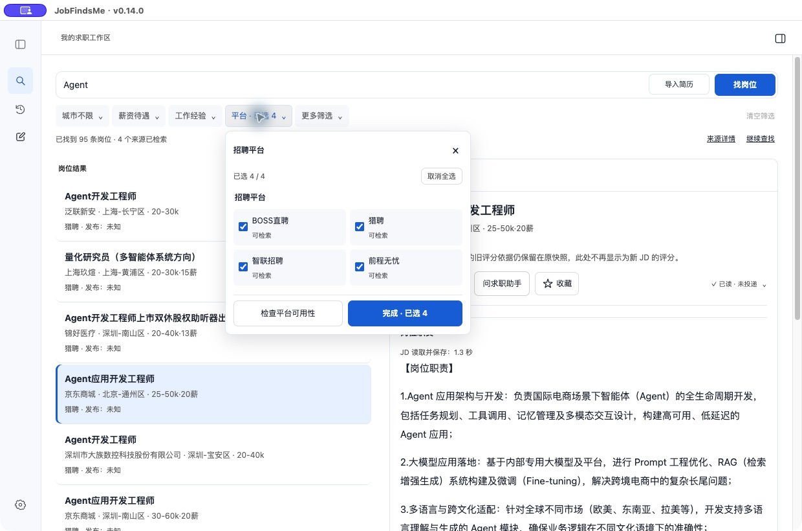
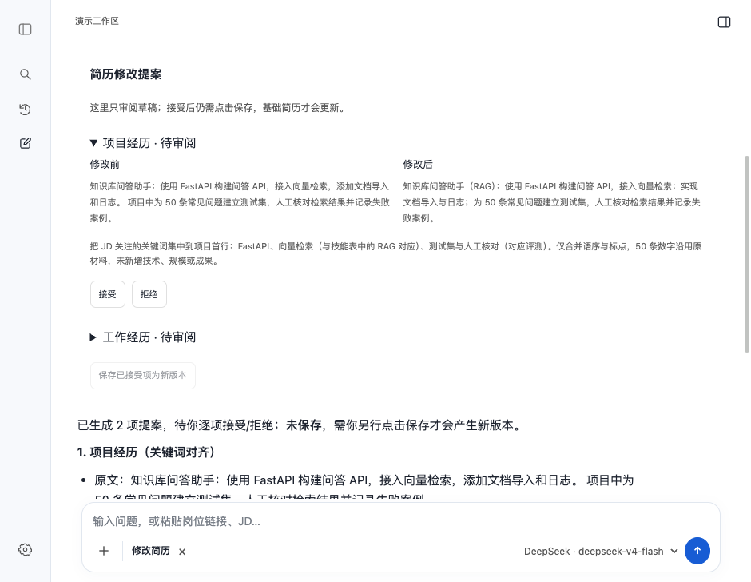
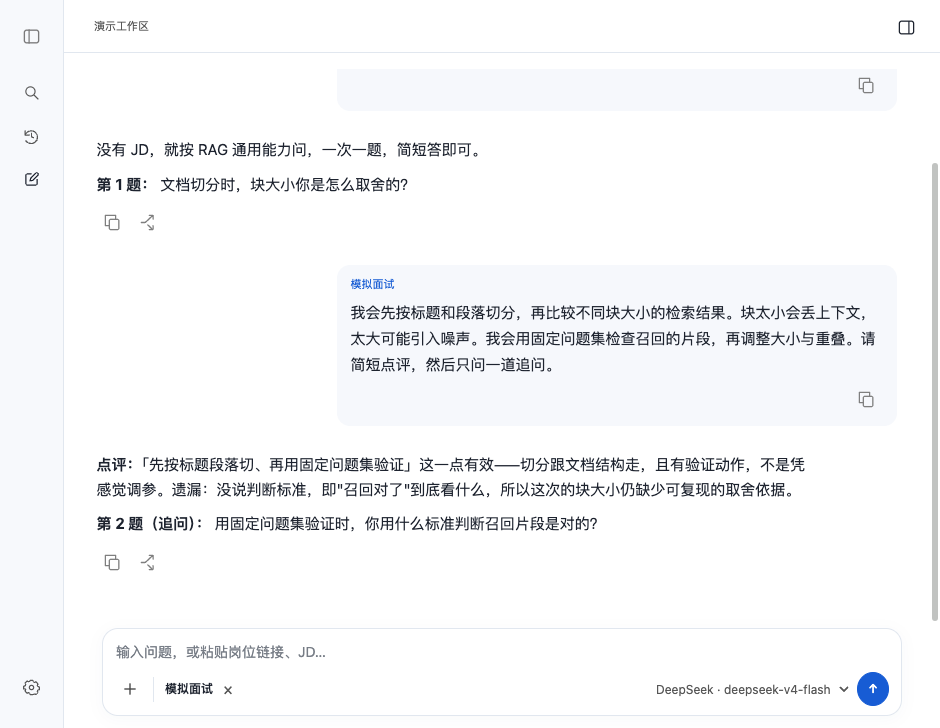
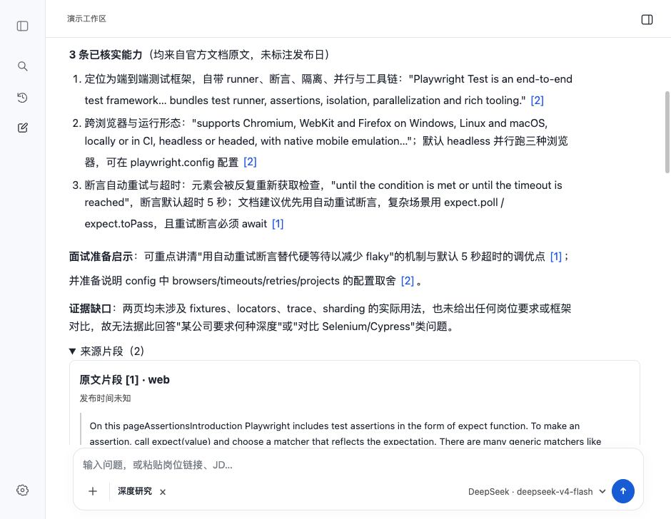

  

<h1 align="center">JobFindsMe</h1>

<strong>Four platforms. One search. Job details and original pages, side by side.</strong> Open-source AI job-search desktop assistant · macOS / Windows

  <a href="https://github.com/russeell/jobfindsme/releases/latest/download/mac-arm64.zip">macOS (Apple Silicon)</a> ·
  <a href="https://github.com/russeell/jobfindsme/releases/latest/download/windows-x64.zip">Windows (x64)</a> ·
  <a href="https://github.com/russeell/jobfindsme/issues">Report an issue</a> · <a href="README.md">简体中文</a>

## Four platforms, one click

Search **BOSS Zhipin, Liepin, Zhaopin and 51job** together as results arrive. Filter, continue searching and fetch full job descriptions when you select a role. **No model configuration needed for job search.**

## A built-in browser, right beside your jobs

Sign in, handle verification and check original sources inside the app. **Tabs, web search, bookmarks and split view** keep your workflow in one window.

Actual v0.14.0 interface showing public listings. Counts reflect this search only; availability depends on sign-in, verification and website changes.

## Find a role. Get ready for it.

<table>
  <tr>
    <th width="33%">Tailor your resume</th><th width="33%">Practice interviews</th><th width="33%">Deep research</th>
  </tr>
  <tr>
    <td></td>
    <td></td>
    <td></td>
  </tr>
  <tr>
    <td>Draft changes from the JD and your real experience. Review before saving.</td>
    <td>One question at a time, with feedback and follow-ups. No JD required.</td>
    <td>Investigate roles, companies and industries, with sources and evidence gaps.</td>
  </tr>
</table>

Click screenshots to enlarge. Resume and interview examples use fictional materials; research reads public official documentation. All show the actual app.

Save jobs and track applications; search, archive and branch conversations.

## Get started in three steps

1. **Download and extract**, then open `JobFindsMe.app` or `JobFindsMe.exe`. No separate runtime installation needed.
2. **Search for jobs**: choose platforms in Settings → Job sources, sign in when needed, enter keywords and choose one city or no city restriction.
3. **Prepare with AI**: configure your own model in Settings → Model settings, then select a skill from the assistant's ＋ menu.

Packages are unsigned. First-launch instructions and checksums are on the [release page](https://github.com/russeell/jobfindsme/releases/latest).

Data is stored locally. AI features send relevant materials to your chosen model service, which may charge for requests. Check research conclusions against the original sources. The app does not apply automatically.

**Disclaimer: This project is intended for learning and personal use only. Follow each platform's usage rules and independently verify job information and AI-generated output.**

[Development](docs/desktop/README.md) · [Contributing](CONTRIBUTING.md) · [Security](SECURITY.md) · [MIT license](LICENSE)
