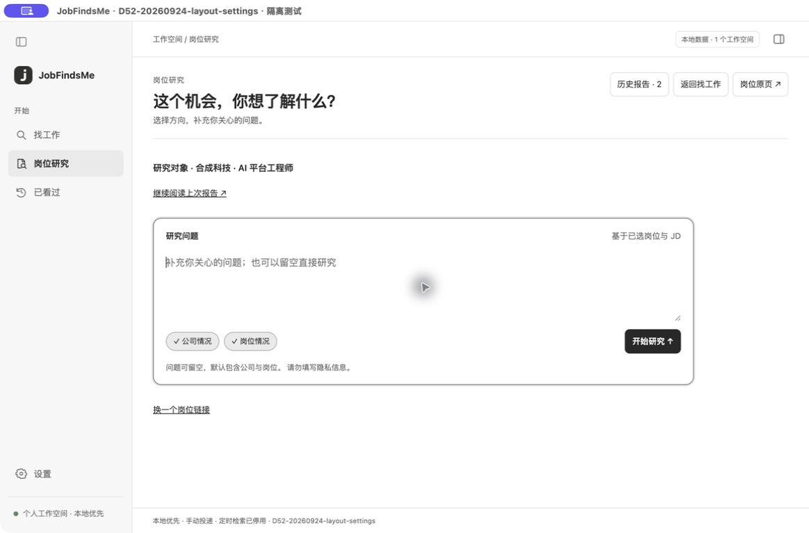

# JobFindsMe

**找到值得考虑的工作，再弄清它是否适合你。**

JobFindsMe 是一款本地优先的桌面求职工具。它把找岗位、查看招聘原页和研究公司与岗位放在同一个工作台里；结论尽量回到可核对的来源，决定仍由你来做。

[English](README.en.md) · [开始使用](#开始使用) · [当前进度](docs/desktop/HANDOFF.md)


*隔离测试中的桌面界面。右侧是招聘网站原页；截图中的岗位、数量和来源状态不代表现在仍可检索。*

## 从机会到判断

1. **找工作。** 输入岗位、技能或方向；确认简历后，也可以留空输入，让经历帮助生成检索词。城市、经验和来源直接在结果页筛选。
2. **看原文。** 岗位列表、详情与招聘网站并排呈现。完整 JD、薪资或发布时间取不到时会说明“未知”，不会拿抓取时间冒充发布日期。
3. **研究岗位。** 从一个岗位出发，核对公司经营与上市信息、正负面反馈、工作强度和福利，以及岗位内容与发展线索。报告保留证据链接、时间和适用范围；查不到的部分明确写成未知。

你可以收藏岗位，区分已读与投递状态，回头继续看。投递始终由你在招聘网站完成；打开原页不会自动标记为已投递。

### 岗位研究是什么样的？

选择岗位后即可提出问题，也可以不输入问题直接开始。研究报告会按公司与岗位组织内容；后续追问会保存为新版本，旧报告仍可打开。公开披露与个人陈述分开呈现，不把零散评价当作整家公司的事实。



*隔离测试中的合成企业报告。没有可核对证据时，报告不会编造结论。*

## 开始使用

目前提供 **macOS 开发版源码运行**，尚无面向普通用户的正式安装包。准备 Git、Python 3.11+ 和 Node.js/npm：

```bash
git clone https://github.com/russeell/jobfindsme.git
cd jobfindsme
python3 -m venv .venv
source .venv/bin/activate
python -m pip install -e ".[dev,browser]"
cd apps/desktop
npm ci
npm run build
npm start
```

首次打开建议这样做：

- 在左侧「设置 → 岗位来源」选择来源，按需要在应用内浏览器登录，并检查来源状态。
- 回到「找工作」输入关键词；简历是可选的，标题旁的小按钮可以导入 PDF、DOCX、Markdown 或 TXT 并核对解析结果。扫描 PDF 暂不支持 OCR。
- 打开感兴趣的岗位，先读招聘原页，再使用「研究岗位」。

桌面端默认使用仓库里的 `.venv/bin/python`；需要其他解释器时设置 `JFM_PYTHON`。

## 你需要知道的边界

- 来源目录包含 **4 个招聘平台和 16 家公司官网**，可浏览不等于可自动检索。登录、列表、分页和完整 JD 的可用性分别检查；遇到验证、限流或网站变动时，以应用内状态为准，已有结果会尽量保留。
- **定时检索已停用**；历史计划和执行记录仍在本机。应用不会自动投递。
- 岗位记录、简历和报告保存在本机；访问招聘网站和公开资料需要联网。自由提问可能成为公开网页检索词，请勿填写隐私信息。普通找岗位和岗位研究不会自动调用付费模型。
- 公开资料可能过时、片面或互相矛盾。报告用于帮助核对，不给公司打分，也不承诺岗位发展或招聘结果。

具体未完成项见[开发交接](docs/desktop/HANDOFF.md)。

## 开发与贡献

桌面界面由 Electron、React 和 TypeScript 构建；本地服务与数据由 Python 和 SQLite 处理。代码主要位于 `apps/desktop/` 与 `src/jobfindsme/`，测试在 `apps/desktop/tests/` 与 `tests/`。

[项目结构](docs/desktop/STRUCTURE.md) · [开发说明](docs/desktop/README.md) · [贡献指南](CONTRIBUTING.md) · [安全说明](SECURITY.md)

旧 CLI/MCP、安装器和 Skill 已退役。历史说明仍可从 Git 历史查阅。

## 许可

当前版本采用 [PolyForm Noncommercial 1.0.0](LICENSE)：允许按条款学习、个人及其他非商业使用，也允许在非商业范围内修改和分发；**商业使用当前版本须另行取得授权**。这是公开源码的**非商业许可**，不是 OSI 定义的开源许可证。第三方依赖遵循各自许可。

本项目先前以 [MIT 许可](LICENSE-MIT-PRIOR)发布；已在旧版本下获得的权利不因本次变更而追溯撤销。许可问题或商业授权需求可通过项目维护者联系。
