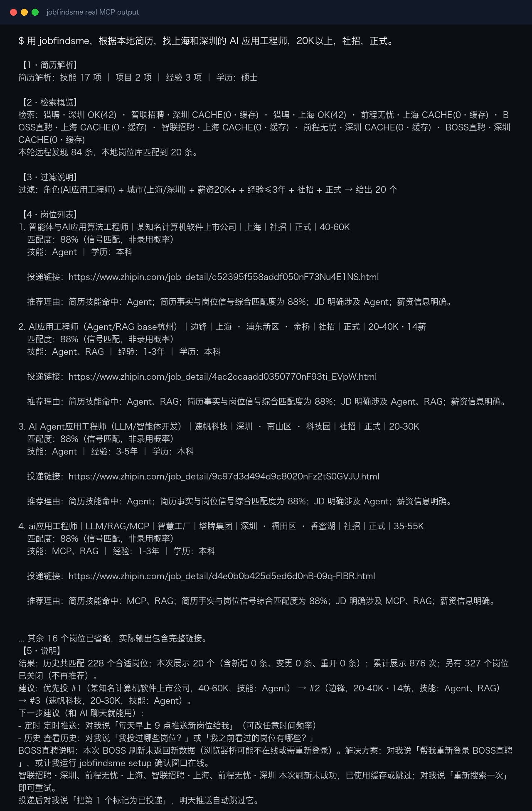

<div align="center">

# jobfindsme · AI 求职雷达

**一句话同时搜 BOSS直聘、猎聘、智联招聘、前程无忧，找到匹配你简历的岗位。**

<p>
  <a href="https://github.com/russeell/jobfindsme/actions/workflows/ci.yml"></a>
  
  
  <a href="LICENSE"></a>
  
</p>

[快速开始](#-快速开始) · [提示词模版](#-提示词模版) · [岗位来源](#-岗位来源) · [工作原理](#-工作原理) · [FAQ](#-faq) · [English](README.en.md)

</div>

---

> ⭐ 如果它帮你省了时间，点个 Star 支持一下，让更多求职者发现这个开源项目。

---

## 它到底是什么

对 AI Agent 说一句话，它同时搜 **BOSS直聘、猎聘、智联招聘、前程无忧** 四个平台，
基于你的简历做确定性、可解释的匹配，返回合适的岗位和投递链接：

```text
用 jobfindsme，根据本地简历（路径：~/Documents/resume.pdf），
找上海和杭州的 AI 应用工程师岗位，20K以上，社招，正式。
```

你只需要理解四个概念，其余全部自动：

| 概念 | 含义 | 示例 |
|---|---|---|
| **Profile**（我是谁） | 简历 → 结构化事实 | 技能、经验、学历 |
| **Search**（我找什么） | 一次搜索的条件 | 上海 + AI应用工程师 + 20K+ |
| **Job**（找到了什么） | 一个岗位 + 证据 + 投递链接 | 岗位、匹配度、链接 |
| **Tracking**（有什么变化） | 与上次相比的新增/变更/关闭，以及已投/已存/已忽略 | 每日推送只报变化 |

几秒后，Agent 返回匹配的岗位列表（上面动图展示同一固定五段结构）：

```text
✅ 猎聘·上海 √ (1.0s)   ✅ BOSS直聘·上海 √ (0.5s)

1. [新增] AI应用工程师（Agent开发）｜星河科技｜上海｜社招｜正式｜25-40K
   匹配度：92%（信号匹配，非录用概率）
   技能：RAG、Agent、MCP ｜ 经验：1-3年 ｜ 学历：本科
   投递链接：https://www.zhipin.com/job_detail/xxx

2. [新增] 大模型应用开发工程师｜云帆智能｜杭州｜社招｜正式｜22-35K
   匹配度：87%（信号匹配，非录用概率）
   技能：LLM、工具调用 ｜ 经验：1-3年 ｜ 学历：本科
   投递链接：https://www.liepin.com/job/xxx

【5·说明】
结果：历史共匹配 96 个合适岗位；本次展示 8 个（全部新增）；累计展示 152 次；另有 12 个岗位已关闭。
建议：优先投 #1（星河科技，25-40K，技能：RAG、Agent、MCP）。
下一步建议（和 AI 聊天就能用）：定时推送 / 查看历史
```

能展示的岗位都已通过角色、地点、薪资、社招/正式等**硬条件**，所以匹配度从
**60% 底分**起步，技能重合、经验、学历等信号再最高加成到 100%——不再出现
"9%"这种容易被误读为概率的低分。

每个岗位的**事实、匹配度和链接由 jobfindsme 固定生成（任何 Agent 一致）**，
推荐理由由 jobfindsme 基于硬条件和结构化岗位信号生成，首次结果由 Agent 原样返回。
只有你另行要求比较岗位时，Agent 才会在结果之后追加独立的证据化分析。

<p align="center">
  
</p>

---

## ✨ 特性

| | |
|---|---|
| 🗣️ **对 Agent 一句话** | 找岗位 / 定时推送 / 查历史，全程自然语言 |
| 🔌 **同时搜四平台** | BOSS直聘 + 猎聘 + 智联招聘 + 前程无忧 一次跑完，避免来回切 App |
| 🧠 **简历结构化匹配** | 本地解析 PDF/MD → 结构化事实 → 技能/经验/学历信号加权，匹配度 60%–100% |
| 🆕 **增量雷达** | 自动识别新增 / 变更 / 重开 / 关闭，重复岗位永不打扰 |
| 📌 **投递状态记忆** | 「标记第 2 个为已投递」→ 本地 SQLite 永久记录 |
| ⏰ **宿主 Agent 定时推送** | 由 Codex、Claude Code 等宿主建立定时任务，定期调用同一搜索工具 |
| 🔒 **本地优先** | 简历只在本地解析，结构化事实不进 Agent 上下文 |
| 🪶 **零部署** | 一个 stdio MCP Server，跑在你自己的机器上 |

---

## 🆚 相比在招聘 App 里手动刷

| 每天找工作时的重复劳动 | jobfindsme 的做法 |
|---|---|
| 在 App 之间来回切换 | 对 Agent 说一句话，四个平台一起搜 |
| 反复刷到同一个岗位 | 自动记住已看、已投、已忽略 |
| 投递过的不记得，又投一遍 | 标记已投递 → 永不重复推荐 |
| 不知道今天有什么新岗位 | 定时推送，只汇报新增和变化 |
| 推荐理由是黑盒 | 服务端确定性排序，附证据、风险和投递链接 |
| 求职状态散落在各平台 | 本地 SQLite 统一记录，可导出可删除 |

---

## ⚠️ 什么时候不适合用它

说清楚比藏着掖着好：

- ❌ **你想海投** — 它不做自动投递。帮你找到值得投的岗位，点链接自己投。
- ❌ **你要覆盖所有公司** — 官网直投、内推、受访问限制的岗位仍会漏。
- ❌ **你不方便在本机跑 Chrome** — BOSS 需要登录态；猎聘纯 HTTP 直连不需要浏览器。
- ❌ **你期待「录用概率预测」** — 匹配分是可解释的确定性排序分，不是录用概率。

---

## 🚀 快速开始

### 🗣️ 最简单：和 Agent 聊天就能装（推荐）

**什么都不用下载、不用敲命令。** 把这段话发给你的 AI Agent
（Claude Code / Codex / Cursor / ZCode）：

```text
请严格按说明快速安装 jobfindsme。请识别你当前是哪一种 Agent；
不要克隆仓库或运行测试：
https://github.com/russeell/jobfindsme/blob/main/INSTALL.md
```

Agent 会自动完成检测环境、安装、写入自己的 MCP 配置。**你只需要重启 Agent**，
然后对它说：

```text
用 jobfindsme，根据我的简历找上海的 AI 应用工程师，20K以上，社招。
```

> 想自己动手？也可以一行命令安装（`curl ... | bash -s -- codex`），
> 完整说明见 [INSTALL.md](INSTALL.md)。

### 登录 BOSS直聘（可选）

直接对 Agent 说：

```text
帮我登录 BOSS直聘
```

Agent 会运行 `jobfindsme setup`，几秒内弹出**专用 Chrome 窗口**。
在窗口里扫码登录，保持窗口运行，然后重启 Agent。

<p align="center">
  
</p>

> 💡 **跳过这步也能用** — 猎聘纯 HTTP 直连，不需要浏览器也不需要登录。
> 先用猎聘看看结果，觉得岗位不够再补上 BOSS。

---

## 💬 提示词模版

**三个核心场景**（直接复制改参数）：

```text
# ① 找岗位
用 jobfindsme 根据 ~/Documents/resume.pdf 找北京的 大模型应用工程师，30K以上，社招。

# ② 定时推送（任意时间任意频率）
每天早上 9 点推送新岗位给我。
每周一晚上 8 点推送。
每两天推一次。

# ③ 查询历史匹配过的岗位
我之前看过的岗位有哪些？
我投过哪些岗位？
昨天推送的岗位还在吗？
```

**进阶**（可选）：

```text
# 只看今天的新增
继续帮我找新岗位，只要今天新增的。

# 换条件
把城市换成深圳，薪资下限改成 25K，重新搜。

# 管理状态
把刚才第 2 个岗位标记为已投递；把外包公司全部忽略。
```

---

## 📦 返回结果

Agent 按固定五段结构输出（简历解析 / 检索概览 / 过滤说明 / 岗位列表 / 说明），
每个岗位块包含：

```text
AI应用工程师（Agent开发）｜示例科技｜上海｜社招｜正式｜25-40K
匹配度：92%（信号匹配，非录用概率）
技能：RAG、Agent、MCP ｜ 经验：1-3年 ｜ 学历：本科

投递链接：https://example.com/jobs/123

推荐理由：简历技能命中：RAG、Agent、MCP；综合匹配度为 92%；薪资信息明确。
需要注意：JD 要求 Kubernetes，简历中未找到直接证据
```

岗位块固定包含：**事实行 + 匹配度 + 空行 + 投递链接（裸 URL 可点击）+ 空行 + 推荐理由**。
匹配度 = 60% 硬条件底分 + 最高 40% 信号加成（技能 > 经验 > 学历 > 活跃度 > 薪资可见），
所有能展示的岗位都已在 60%–100% 区间内，且按匹配度从高到低排列。
事实、匹配度、链接、基础推荐理由和风险都由 Server 确定生成，任何 Agent 一致；
首次搜索时 Agent 不得在岗位块内追加、删除或改写内容；只有用户另行要求比较时，
才可在完整结果之后追加独立的证据化分析。

结果不足时 Agent 不会用弱匹配岗位凑数；来源字段不完整时会明确标注。
设置薪资下限时，默认排除薪资未公开岗位；也可明确说“保留薪资面议岗位”，
系统会保留并逐条提示信息缺口。

---

## 🌐 岗位来源

当前维护四个来源：**BOSS直聘 + 猎聘 + 智联招聘 + 前程无忧**。项目优先
保证每个来源能稳定返回有效岗位，不用名义上的平台数量冒充覆盖率；被平台
安全校验拦截的来源会在结果里明确标注，不会静默当作"没有岗位"。

| 来源 | 方式 | 速度 | 需要浏览器？ |
|---|---|---|---|
| **BOSS直聘** | 用户授权的本地 Chrome CDP，在页面上下文异步读取站点响应 | ~0.5s | ✅ 需要（登录态） |
| **猎聘** | `api-c.liepin.com` 纯 HTTP JSON API | ~1.0s | ❌ 不需要 |
| **智联招聘** | `fe-api.zhaopin.com` 纯 HTTP JSON API；被拦时自动走浏览器兜底 | ~1.0s | 仅兜底时 |
| **前程无忧** | `we.51job.com` 纯 HTTP JSON API；被拦时自动走浏览器兜底 | ~1.0s | 仅兜底时 |

猎聘优先纯 HTTP 直连（亚秒级、无需浏览器）；本机已运行 Chrome 时，
再自动用浏览器补充岗位详情页的 JD 文本，进一步丰富匹配信号。

> ⚠️ **智联招聘 / 前程无忧为实验性来源**：两个平台目前都部署了阿里云
> WAF 安全校验，纯 HTTP 请求在部分网络环境下会被拦截。拦截时会自动尝试
> **浏览器兜底**（复用 `jobfindsme setup` 的 Chrome 桥，让真实页面通过校验）；
> 浏览器也不可用时才标记"被安全校验拦截"，并继续返回其他来源结果。

---

## ⚙️ 工作原理

```text
Agent (Claude/GPT/Qwen/WorkBuddy — 负责交互与后续解释)
  → MCP Server (本地 stdio)
  → 本地 Core
      → 纯 HTTP 直连（猎聘 / 智联 / 前程无忧）
      → 本地 Chrome CDP（BOSS直聘登录页面上下文中执行请求）
      → 快速模式：有界并行刷新全部来源，单源失败不阻断其他来源
  → 标准化 → 跨来源去重 → 硬过滤（城市/薪资/校招社招/实习正式）
  → 信号提取 + 加权粗筛（技能/经验/学历/活跃度/薪资）
  → 增量雷达（新增/变化/重开/关闭识别）
  → Server 输出固定五段结果，Agent 原样交付
```

MCP Server 负责硬过滤、结构化信号提取、确定性排序和固定五段呈现。
Agent 负责自然语言交互；用户追问岗位对比时，才基于返回证据补充分析，
不默默重排、删除或改写基础结果。

简历、岗位状态和搜索计划全部保存在本地 SQLite。Core 不需要模型 API。

---

## 🔒 隐私与安全

- 完整简历不进入 Agent 上下文，只把本地路径交给 Core 解析；
- 岗位描述按不可信外部数据处理，不作为 Agent 指令；
- 导出写入本地文件；删除走「预览 + 确认令牌」两阶段协议；
- 不自动投递、不绕过验证码、不承诺覆盖全部岗位。

---

## ❓ FAQ

**Q：平台都要登录吗？**
只有 BOSS 需要（扫码一次，后续复用本地登录态）。猎聘纯 HTTP 直连，不需要浏览器。

**Q：会不会封号？**
它做的是低频、拟人节奏的读取，不批量抓取、不自动操作。但自动化访问在平台条款里
都属于灰色地带，存在账号被限制的可能 — 请个人低频使用，风险自负。

**Q：搜索结果为什么是 0 / 某个平台经常没有结果？**
先跑 `jobfindsme doctor` 自检。BOSS 检查本地 Chrome 和登录态；猎聘检查 HTTP
来源状态。来源失败时系统会明确标注降级或缓存，不会静默伪装成实时结果。

**Q：简历会被上传吗？**
不会。简历只在本地解析成结构化事实存入 SQLite，完整简历文本不进入 Agent 上下文。
`export_local_data` / `delete_local_data` 可随时导出和清除。

**Q：和直接把简历发给 AI 让它搜，有什么区别？**
通用 Agent 没有平台接入、没有跨天去重和状态记忆、也不能稳定解析 PDF 简历成结构化
事实。jobfindsme 把这三件事做成了确定性的本地服务，Agent 只负责对话。

---

## 🛠 开发

```bash
python -m pip install -e ".[dev]"
python -m pytest
ruff check . && ruff format --check .
```

架构、来源门禁和评测闭环见 [architecture](docs/architecture.md)、
[connectors](docs/connectors.md)、[evaluation](docs/evaluation.md)；
完整工程规范在 `docs/internal/project_spec.md`。
发现错排、漏排、重复或失效链接，请提交脱敏
[Issue](https://github.com/russeell/jobfindsme/issues)。

---

## ⚖️ 免责声明

- 本项目为免费开源的个人学习工具，帮助整理你**已登录、有权查看**的岗位信息；
- 自动化访问招聘平台可能触发对方风控，由此产生的账号限制、封禁等后果由使用者
  自行承担，与作者无关；
- 禁止用于商业转售、大规模爬取或绕过平台限制；
- 平台页面结构随时可能变化导致某个来源失效，请通过 Issue 反馈，作者会尽力跟进。

---

## 📄 License

[MIT](LICENSE)
