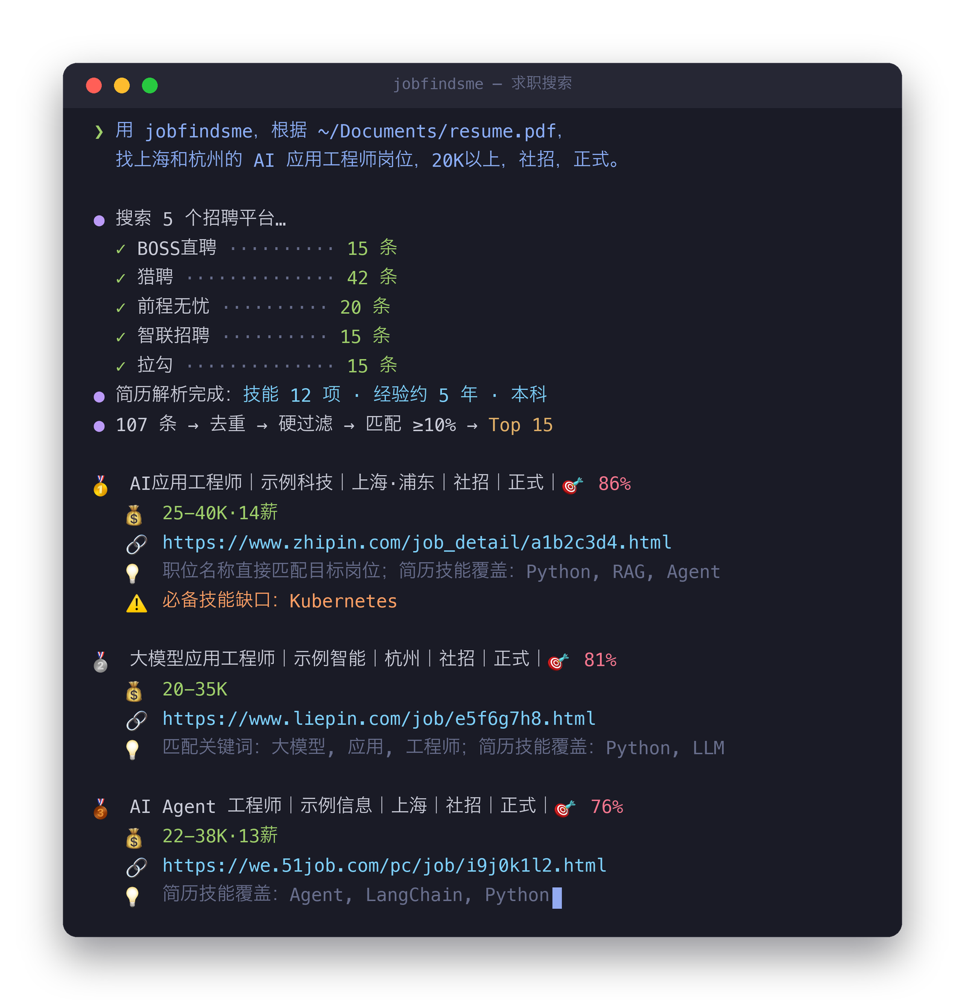
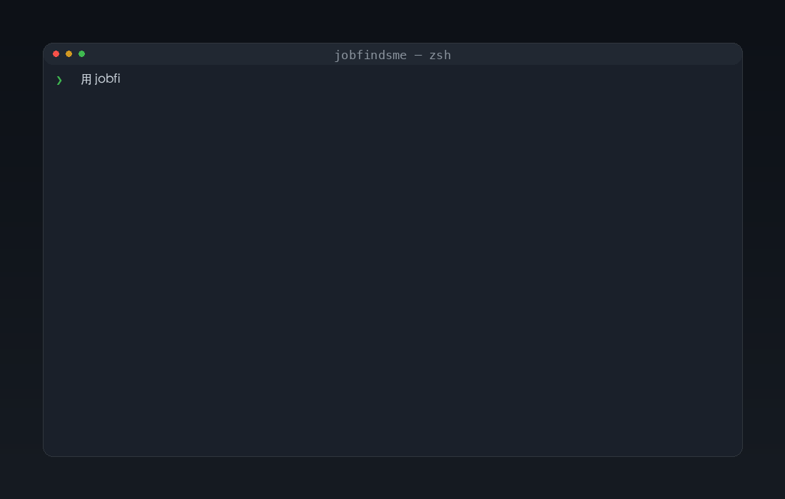

<div align="center">

# jobfindsme · AI 求职引擎

**给你的 AI Agent 装一个求职引擎 —— 五大招聘平台一站式搜索，简历不出本地，每条推荐都有证据。**

[](https://github.com/russeell/jobfindsme/actions/workflows/ci.yml)
[](https://www.python.org/)
[](https://modelcontextprotocol.io/)
[](https://github.com/russeell/jobfindsme/releases)
[](LICENSE)

[为什么用它](#为什么不用招聘-app) · [快速开始](#快速开始) · [提示词模版](#提示词模版) · [FAQ](#faq) · [English](README.en.md)



</div>

---

你说一句话：

```text
用 jobfindsme，根据 ~/Documents/resume.pdf，
找上海和杭州的 AI 应用工程师岗位，20K以上，社招，正式。
```

jobfindsme 同时搜 **BOSS直聘 · 猎聘 · 前程无忧 · 智联 · 拉勾**，返回这样的结果：

<div align="center">

</div>

匹配度、推荐理由、投递链接一条不少。低于 10% 匹配的直接过滤。

## 为什么不用招聘 App？

| | 招聘 App | jobfindsme |
|---|---|---|
| 搜索范围 | 一个平台 | **五大平台统一搜索** |
| 简历 | 上传到平台服务器 | **留在本地，Agent 都读不到全文** |
| 推荐理由 | 黑盒算法 | **每条有证据**：技能 ↔ JD 逐条对照 |
| 模型 API | — | **不需要**，本地确定性匹配，零 API key |
| 数据 | 平台持有 | **本地 SQLite**，一键导出、两阶段安全删除 |

## 什么时候不适合用它

说清楚比藏着掖着好：

- **你想海投** —— jobfindsme 不做自动投递。它帮你找到值得投的岗位，点链接自己投。
- **你要覆盖所有公司** —— 五大平台覆盖主流渠道，但部分岗位只在官网或内推发布，不保证全网。
- **你不方便运行本地浏览器桥** —— 当前五个平台都通过本地 Chrome CDP 读取；BOSS 还需要账号登录。
- **你期待语义级理解** —— 匹配是确定性算法（BM25 + 硬过滤），不调用大模型。可解释、可复现，但不会"读懂"简历和 JD 的深层含义。

## 快速开始

jobfindsme 是标准 **MCP Server**，适配所有 MCP 兼容的 Agent（Claude Code、Codex、Kimi、TRAE、WorkBuddy、ZCode、Hermes、OpenClaw、Qoder……）。

### 第 1 步：安装

最简单的方式 —— 跟你的 Agent 说一句话：

```text
帮我安装 jobfindsme：https://github.com/russeell/jobfindsme/blob/main/INSTALL.md
```

Agent 会自动装包、配置 MCP、安装 Skill。

或者手动：

```bash
pip install "jobfindsme @ git+https://github.com/russeell/jobfindsme.git@main"
jobfindsme install claude    # Claude Code。换成 codex / kimi / trae / zcode / workbuddy 均可
```

> [!TIP]
> Agent 不在快捷名单里？`jobfindsme config` 输出标准 MCP JSON，粘贴到任意 Agent 的配置文件即可。

### 第 2 步：启动本地浏览器桥并登录 BOSS

```bash
jobfindsme setup   # 启动隔离 Chrome；登录后搜索期间保持它运行
```


> [!IMPORTANT]
> 五个平台都通过这个本地浏览器桥搜索。只有 BOSS 必须登录账号；其他平台通常可直接访问，但仍可能触发验证码或临时限制。

### 第 3 步：重启 Agent，开始搜索

```text
用 jobfindsme，根据 ~/Documents/resume.pdf，
找上海和杭州的 AI 应用工程师岗位，20K以上，社招，正式。
```

## 提示词模版

直接抄改：

```bash
# 有简历，精确搜
用 jobfindsme，根据 ~/Documents/我的简历.pdf，
找上海和深圳的 AI Agent 工程师岗位，25K以上，社招，正式，1-5年经验。

# 有简历，放宽搜
用 jobfindsme，根据 ~/Documents/我的简历.pdf，找杭州的大模型应用开发岗位，校招。

# 无简历，快速浏览
用 jobfindsme，搜北京的自动驾驶算法岗位，30K以上，社招。

# 查看详情 / 收藏
用 jobfindsme，看一下第 3 个岗位的详细内容。
用 jobfindsme，把第 1、4、6 个岗位存起来。
```

**完整字段**（`[]` 为可选，去掉不需要的行）：

```text
用 jobfindsme，
根据 [简历路径]                      ← 有简历才写，自动解析匹配
找 [城市] 的 [岗位方向] 岗位         ← 必填
薪资 [最低K]-[最高K] 或 [金额] 以上  ← 可选
[校招 / 社招]  [实习 / 正式]         ← 可选
[0-3年 / 3-5年 / …] 经验            ← 可选
排除 [外包 / 996 / …]               ← 可选
```

## 平台覆盖

| 平台 | 访问前提 | 特点 |
|------|------|------|
| **BOSS直聘** | 浏览器桥 + 登录 | 岗位量大，常见明文薪资 |
| **猎聘** | 浏览器桥 | 中高端 + 外企中国岗 |
| **前程无忧** | 浏览器桥 | 传统行业 + IT，覆盖广 |
| **智联招聘** | 浏览器桥 | 综合招聘 |
| **拉勾** | 浏览器桥 | 互联网岗位 |

腾讯、阿里、字节、拼多多、小米、网易、美团……绝大部分中国互联网公司的岗位都在这五个平台上发布。

## 工作原理

```text
你说一句话
      │
      ▼
  任意 MCP Agent（Claude Code / Codex / WorkBuddy / …）
      │
      ▼
  jobfindsme MCP Server（本地 stdio）
      │
      └── Chrome CDP ──→ BOSS · 猎聘 · 前程无忧 · 智联 · 拉勾
      │
      ▼
  去重 → 硬过滤（地点/薪资/年限）→ BM25 匹配 → ≥10% → Top 15 + 理由 + 链接
```

简历解析、匹配、打分全部在本地完成，不依赖任何模型 API 或云端服务。

## MCP 工具

| 工具 | 做什么 |
|------|--------|
| `setup_profile` | 导入简历，自动解析技能/经验/学历 |
| `configure_search` | 设角色/城市/薪资/年限/排除词 |
| `search_jobs` | 五平台搜索 + 匹配打分 |
| `get_jobs` | 翻页浏览本地结果 |
| `get_job_details` | 单个岗位详情 |
| `update_job_state` | 收藏 / 忽略 / 已投递 |
| `configure_monitor` | 定时刷新 |
| `export_local_data` | 本地数据导出 |
| `delete_local_data` | 预览 → 令牌确认，两阶段安全删除 |

## 隐私与安全

- **简历不出本地** —— Agent 只拿到文件路径，完整文本不进入模型上下文
- **最少存储** —— 只存结构化事实（技能、年限、学历）和最小证据片段
- **本地数据库** —— SQLite，文件权限 0600，WAL 模式
- **删除两步走** —— `preview` 预览 → 单次令牌 `confirm`，防止误删
- **岗位描述视为不可信内容** —— 不作为指令注入模型

## FAQ

**Q：搜不到 BOSS 岗位？**
先确认专用 Chrome 仍在运行，再确认 BOSS 登录态。运行 `jobfindsme setup` 重新启动浏览器桥，也可以用 `jobfindsme doctor` 诊断。

## 真实搜索质量 Loop

单元测试只证明代码契约。真实来源是否可用、数据是否完整，要用 Live Loop 记录：

```bash
python -m jobfindsme.evaluation.live_loop \
  --agent-host codex --allow-browser-sources --day 1
```

报告保存在 `~/.jobfindsme/reports/`，包含各来源成功率与耗时、抓取/去重/匹配数量、字段完整度和待人工标注 Top 10。只有累计真实人工标签后，才能对外声称推荐质量。

**Q：匹配度怎么算的？**
硬过滤（地点/薪资/年限/排除词）先砍掉不合格岗位，再用 BM25 对岗位方向打分，加上技能覆盖、标题命中、城市命中。确定性算法，可复现。每条结果附 evidence，能看到具体命中了哪些关键词和技能。

**Q：没有简历能用吗？**
能。有简历才出匹配分和技能对照，没简历就是纯搜索。低于 10% 匹配的结果自动过滤。

**Q：数据存在哪？会上传吗？**
`~/.jobfindsme/data/jobfindsme.db`，本地 SQLite。没有遥测，没有云同步。`export_local_data` 一键导出，`delete_local_data` 两阶段删除。

**Q：会不会导致平台账号被限制？**
工具只在你本机操作你自己登录的 Chrome，模拟正常浏览行为。但自动化访问仍可能触发平台风控——请控制搜索频率，配合 `configure_monitor` 做定时刷新（默认 24 小时一次）而不是手动高频搜索。后果自负，详见[免责声明](#免责声明)。

## 参与贡献

- **报 Bad Case**：错排 / 漏排 / 重复 / 失效岗位 —— [提 Issue](https://github.com/russeell/jobfindsme/issues)，记得脱敏
- **提功能**：先开 Issue 描述场景和方案，讨论通过后再提 PR，避免白干
- **补语料**：中文职位别名、地点、薪资样本的 PR 永远欢迎
- **加 Connector**：欢迎补充合规的企业招聘官网 Connector

## 免责声明

jobfindsme 是本地工具，仅供学习研究和个人求职使用。

**技术手段说明：** CDP 连接器通过用户已登录的本地 Chrome 浏览器提取岗位信息，
其中 BOSS直聘 的搜索依赖注入 XHR 调用平台内部 API。
这些操作可能违反招聘平台的用户协议，使用本工具可能导致你的平台账号被限制或封禁。

**隐私提示：** 搜索返回的岗位数据（含招聘者信息）会保存在本地数据库中。
请勿将数据库文件分享给他人。

**使用者承担全部责任。** 本项目不鼓励、不支持商业转售、大规模爬取、
绕过平台反爬措施、或任何违反法律法规的使用方式。

## License

[MIT](LICENSE)
