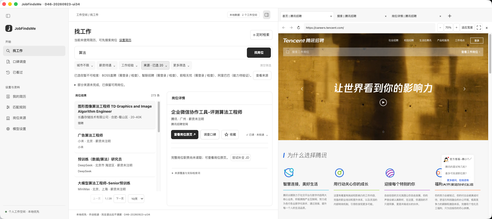

# JobFindsMe

**找到合适的岗位，再多了解一点即将加入的公司。**

JobFindsMe 是一个本地桌面求职工具，把岗位检索、岗位研究和简历维护放在同一个工作台里。你可以一边筛选岗位，一边打开招聘原页；看到感兴趣的机会，再核对公司和岗位的公开资料。

[English](README.en.md) · [开始使用](#开始使用) · [开发文档](docs/desktop/README.md)



*D46 历史界面截图：岗位列表、详情和招聘网站并排显示。截图中的侧栏与当前版本不同，岗位和来源状态也仅代表拍摄时的结果。*

## 找工作，少切几个窗口

输入岗位或技能关键词，选择城市、薪资、工作经验和招聘来源，集中查看机会。确认简历后，也可以留空关键词，由真实技能与经历生成有限检索方向；实际使用词会显示在结果中。所有城市、薪资等条件都在找工作页设置。

- **自己决定搜哪里**：选择多个招聘平台和公司官网，也可以一键全选、检查来源状态。
- **看见岗位，也看见原文**：在列表中浏览岗位，打开右侧浏览器查看招聘原页；详情不完整时，可以尝试补全 JD 或直接阅读原页。
- **知道哪些信息缺失**：发布日期取自来源；未提供时显示“未知”，不会把抓取日期当成发布日期。薪资和完整 JD 未知时也会明确标注。
- **保留求职进度**：收藏感兴趣的岗位，区分已读与投递状态，回来时接着看。
- **手动查更新**：按需检索岗位，历史计划与执行记录仍保存在本机。

投递由你在招聘网站完成。打开岗位链接不会被记作已经投递。

## 投递之前，研究岗位与公司

在岗位详情中点击「研究岗位」，选择公司情况、岗位内容与发展，或同时选择两项。

| 调查方向 | 可以了解什么 |
| --- | --- |
| **公司情况** | 经营与上市资料、正负面反馈、工作强度和日常福利；经营与上市优先核对官方披露 |
| **岗位内容与发展** | 保存时的岗位 JD、职责与技能；结合可核对的公司经营资料分析发展线索 |

报告会保存在该岗位下，方便随时重看；更新研究会保存一份新报告，旧证据仍可追溯。报告分别标明官方披露与个人陈述，附来源、发布时间和适用范围。没有可核对证据时会明确标为未知。

发展线索仅按 JD 与公司证据分析，不推断晋升承诺，也不为企业打分或推荐。

## 简历维护，保持简单

导入 **PDF、DOCX、Markdown 或 TXT**，核对技能、工作与项目经历，再确认用于岗位检索。导入中的内容不会提前参与搜索。你也可以清除当前简历，只用关键词找岗位。

清除当前简历不会删除旧搜索和调查引用的快照。扫描 PDF 暂不支持 OCR，旧版 DOC 请先转成 DOCX。

## 招聘网站，就在工作台里

内嵌浏览器支持多标签浏览，登录后会保留本应用的会话，方便下次继续使用。网站要求重新验证或会话过期时，仍需要你重新登录。

自动检索遇到障碍时，可以打开原网站继续查找。网页能打开不代表系统一定能自动读取其中的岗位，来源状态会单独提示。

目前来源目录包含 **4 个招聘平台和 16 家公司官网**。各来源的可用程度不同，部分功能仍在验证和完善中，请以应用内的检查结果为准。

## 开始使用

目前项目处于 **macOS 桌面开发阶段**。如果你愿意从源码运行，需要先安装 Git、Python 3.11+ 和 Node.js/npm。

```bash
git clone https://github.com/russeell/jobfindsme.git
cd jobfindsme

# 准备本地 Python 环境
python3 -m venv .venv
source .venv/bin/activate
python -m pip install -e ".[dev,browser]"

# 构建并启动桌面应用
cd apps/desktop
npm ci
npm run build
npm start
```

第一次打开后，可以按这个顺序使用：

1. 在「岗位来源」选择想检索的平台，按提示登录并检查状态。
2. 在「找工作」输入关键词开始检索；需要按个人经历匹配时，再到「我的简历」导入并确认简历。
3. 打开感兴趣的岗位，查看原页、收藏，或发起岗位研究。

桌面端默认使用仓库内的 `.venv/bin/python`。如果使用其他 Python 环境，可通过 `JFM_PYTHON` 指定解释器路径。

## 使用前了解这些限制

- **来源仍在完善**：智联登录后的检索链路仍有待验证项，阿里岗位详情存在已知访问问题。其他来源也可能受网站改版、登录或访问限制影响。详见[当前状态](docs/desktop/HANDOFF.md)。
- **定时检索已停用**：不会自动执行或补跑，不能新建或恢复计划；历史计划和执行记录仍保存在本机。
- **本地保存不等于完全离线**：岗位记录、简历和报告保存在本机；检索网站需要联网。普通找岗位流程不会自动调用付费模型。
- **公开评价不是确定事实**：JobFindsMe 仅整理公开信息和原始来源，不保证用户陈述的真实性、完整性或代表性，不对公司或岗位作评分、推荐或好坏判断。请结合岗位、团队、时间和原文自行判断。

## 想参与开发？

项目使用 **Electron + React + TypeScript** 构建桌面界面，**Python + SQLite** 处理本地服务和数据。

```text
apps/desktop/       桌面界面、内嵌浏览器与系统集成
src/jobfindsme/      检索、岗位研究、简历与本地数据服务
tests/              Python 回归测试
evaluation/         检索与匹配评测
scripts/            构建和检查工具
docs/               使用、设计与开发文档
```

[目录与模块说明](docs/desktop/STRUCTURE.md) · [技术方案](docs/desktop/TECHNICAL.md) · [开发与验收](docs/desktop/DEVELOPMENT.md) · [贡献指南](CONTRIBUTING.md)

已有 CLI/MCP 用户可查阅[兼容文档](docs/legacy/README.zh.md)。这些入口暂时保留，不影响桌面应用的使用。

[安全说明](SECURITY.md) · [MIT License](LICENSE)
