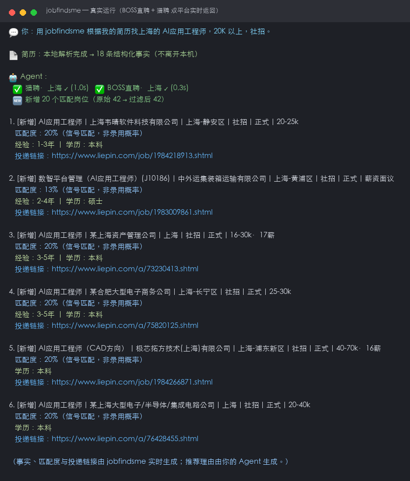

<div align="center">

# jobfindsme · AI 求职雷达

**一句话同时搜 BOSS直聘 + 猎聘，找到匹配你简历的岗位。**

<p>
  <a href="https://github.com/russeell/jobfindsme/actions/workflows/ci.yml"></a>
  
  
  <a href="https://github.com/russeell/jobfindsme/releases"></a>
  <a href="LICENSE"></a>
  
</p>

[快速开始](#-快速开始) · [提示词模版](#-提示词模版) · [岗位来源](#-岗位来源) · [工作原理](#-工作原理) · [FAQ](#-faq) · [English](README.en.md)

</div>

---

## 一图胜千言 · 真实运行 demo

约 15 秒看完一次完整搜索：你打出一句话 → 简历在本地解析成结构化事实 →
**BOSS直聘 + 猎聘** 两个平台实时返回 → 输出带匹配度与投递链接的岗位列表。
全程一屏展示、无剪辑，每一条岗位都由 `jobfindsme` 自身代码实时生成，不是示意图。

<p align="center">
  
</p>

<details>
<summary>📸 等不及动画？先看一张静态效果截图（同为实时渲染，非 mock）</summary>
<br>
<p align="center">
  
</p>
</details>

> 💡 图中两个平台一起出结果 —— 录制时本机已通过 `jobfindsme setup` 登录 BOSS 专用 Chrome；
> 未登录时 BOSS 会自动跳过并明确标注，不会静默少一个平台。

---

## 它到底是什么

对 AI Agent 说一句话，它同时搜 **BOSS直聘** 和 **猎聘** 两个平台，
基于你的简历做语义匹配，返回合适的岗位和投递链接：

```text
用 jobfindsme，根据本地简历（路径：~/Documents/resume.pdf），
找上海和杭州的 AI 应用工程师岗位，20K以上，社招，正式。
```

几秒后，Agent 返回匹配的岗位列表（上面动图同一次运行的真实输出节选）：

```text
✅ 猎聘·上海 ✓ (1.0s)   ✅ BOSS直聘·上海 ✓ (0.5s)
🆕 新增 20 个匹配岗位（原始 42 → 过滤后 42）

1. [新增] AI应用工程师｜上海韦晴软件科技有限公司｜上海-静安区｜社招｜正式｜20-25k
   匹配度：20%（信号匹配，非录用概率）
   经验：1-3年 ｜ 学历：本科
   投递链接：https://www.liepin.com/job/1984218913.shtml

2. [新增] 数智平台管理（AI应用工程师）(J10186)｜中外运集装箱运输有限公司｜上海-黄浦区｜社招｜正式｜薪资面议
   匹配度：13%（信号匹配，非录用概率）
   经验：2-4年 ｜ 学历：硕士
   投递链接：https://www.liepin.com/job/1983009861.shtml
```

每个岗位的**事实、匹配度和链接由 jobfindsme 固定生成（任何 Agent 一致）**，
推荐理由由你的 Agent 基于这些信号与你的简历生成。

---

## ✨ 特性

| | |
|---|---|
| 🗣️ **对 Agent 一句话** | 找岗位 / 定时推送 / 查历史，全程自然语言 |
| 🔌 **同时搜双平台** | BOSS直聘 + 猎聘 一次跑完，避免来回切 App |
| 🧠 **简历结构化匹配** | 本地解析 PDF/MD → 结构化事实 → 技能/经验/学历加权打分 |
| 🆕 **增量雷达** | 自动识别新增 / 变更 / 重开 / 关闭，重复岗位永不打扰 |
| 📌 **投递状态记忆** | 「标记第 2 个为已投递」→ 本地 SQLite 永久记录 |
| ⏰ **任意时间任意频率推送** | 每天 9 点 / 每周一晚 8 点 / 每两天一次，配 cron 即可 |
| 🔒 **本地优先** | 简历只在本地解析，结构化事实不进 Agent 上下文 |
| 🪶 **零部署** | 一个 stdio MCP Server，跑在你自己的机器上 |

---

## 🆚 相比在招聘 App 里手动刷

| 每天找工作时的重复劳动 | jobfindsme 的做法 |
|---|---|
| 在 App 之间来回切换 | 对 Agent 说一句话，两个平台一起搜 |
| 反复刷到同一个岗位 | 自动记住已看、已投、已忽略 |
| 投递过的不记得，又投一遍 | 标记已投递 → 永不重复推荐 |
| 不知道今天有什么新岗位 | 定时推送，只汇报新增和变化 |
| 推荐理由是黑盒 | Agent 语义匹配，附理由和投递链接 |
| 求职状态散落在各平台 | 本地 SQLite 统一记录，可导出可删除 |

---

## ⚠️ 什么时候不适合用它

说清楚比藏着掖着好：

- ❌ **你想海投** — 它不做自动投递。帮你找到值得投的岗位，点链接自己投。
- ❌ **你要覆盖所有公司** — 官网直投、内推、受访问限制的岗位仍会漏。
- ❌ **你不方便在本机跑 Chrome** — BOSS 需要登录态；猎聘纯 HTTP 直连不需要浏览器。
- ❌ **你期待「录用概率预测」** — 匹配分是可解释的确定性排序分，不是录用概率。

---

## 🚀 快速开始

### 🗣️ 最简单：和 Agent 聊天就能装（推荐）

**什么都不用下载、不用敲命令。** 把这段话发给你的 AI Agent
（Claude Code / Codex / Cursor / ZCode / WorkBuddy 等任何 Agent）：

```text
请严格按说明快速安装 jobfindsme。请识别你当前是哪一种 Agent；
不要克隆仓库或运行测试：
https://github.com/russeell/jobfindsme/blob/main/INSTALL.md
```

Agent 会自动完成检测环境、安装、写入自己的 MCP 配置。**你只需要重启 Agent**，
然后对它说：

```text
用 jobfindsme，根据我的简历找上海的 AI 应用工程师，20K以上，社招。
```

> 想自己动手？也可以一行命令安装（`curl ... | bash -s -- codex`），
> 完整说明见 [INSTALL.md](INSTALL.md)。

### 登录 BOSS直聘（可选）

直接对 Agent 说：

```text
帮我登录 BOSS直聘
```

Agent 会运行 `jobfindsme setup`，几秒内弹出**专用 Chrome 窗口**。
在窗口里扫码登录，保持窗口运行，然后重启 Agent。

<p align="center">
  
</p>

> 💡 **跳过这步也能用** — 猎聘纯 HTTP 直连，不需要浏览器也不需要登录。
> 先用猎聘看看结果，觉得岗位不够再补上 BOSS。

---

## 💬 提示词模版

**三个核心场景**（直接复制改参数）：

```text
# ① 找岗位
用 jobfindsme 根据 ~/Documents/resume.pdf 找北京的 大模型应用工程师，30K以上，社招。

# ② 定时推送（任意时间任意频率）
每天早上 9 点推送新岗位给我。
每周一晚上 8 点推送。
每两天推一次。

# ③ 查询历史匹配过的岗位
我之前看过的岗位有哪些？
我投过哪些岗位？
昨天推送的岗位还在吗？
```

**进阶**（可选）：

```text
# 只看今天的新增
继续帮我找新岗位，只要今天新增的。

# 换条件
把城市换成深圳，薪资下限改成 25K，重新搜。

# 管理状态
把刚才第 2 个岗位标记为已投递；把外包公司全部忽略。
```

---

## 📦 返回结果

Agent 按固定五段结构输出（简历解析 / 检索概览 / 过滤说明 / 岗位列表 / 说明），
每个岗位块包含：

```text
大模型应用开发工程师｜示例科技｜上海｜社招｜正式｜25-40K
匹配度：条件符合 4/4（提供简历后升级为信号匹配度）

投递链接：https://example.com/jobs/123

推荐理由：JD 要求 RAG、Agent、FastAPI，与你的简历高度重叠
需要注意：JD 要求 Kubernetes 经验，简历中未找到直接证据
```

岗位块固定包含：**事实行 + 匹配度 + 空行 + 投递链接（裸 URL 可点击）+ 空行 + 推荐理由**。
其中事实、匹配度和链接由 Server 确定生成（任何 Agent 完全一致）；推荐理由
由 Agent 基于信号与简历生成（措辞因模型而异，但依据相同）。

结果不足时 Agent 不会用弱匹配岗位凑数；来源字段不完整时会明确标注。

---

## 🌐 岗位来源

**默认双平台**：从 v0.3.1 起精简为 BOSS直聘 + 猎聘。两者覆盖了中国技术岗位市场的绝大部分，
维护成本与稳定性远优于四平台并存。

| 来源 | 方式 | 速度 | 需要浏览器？ |
|---|---|---|---|
| **BOSS直聘** | 本地 Chrome CDP，XHR 注入内部 API | ~0.5s | ✅ 需要（登录态） |
| **猎聘** | `api-c.liepin.com` 纯 HTTP JSON API | ~1.0s | ❌ 不需要 |

旧版本曾支持 前程无忧 / 智联招聘 / 拉勾，前两者因 WAF / 蜜罐稳定性不足被默认移除，
拉勾因字段完整度过低被下线；连接器仍在仓库中保留，可手动 `--sources` 启用。

---

## ⚙️ 工作原理

```text
Agent (Claude/GPT/Qwen/WorkBuddy — 负责语义精排)
  → MCP Server (本地 stdio)
  → 本地 Core
      → 纯 HTTP 直连（猎聘亚秒级）
      → 浏览器 CDP 拦截（BOSS直聘 SPA 自带签名，被动读取 JSON）
      → 快速模式：刷新主来源，复用其他来源缓存
      → 全量模式：并行刷新双平台
  → 标准化 → 跨来源去重 → 硬过滤（城市/薪资/校招社招/实习正式）
  → 信号提取 + 加权粗筛（技能/经验/学历/活跃度/薪资）
  → 增量雷达（新增/变化/重开/关闭识别）
  → Agent 收到 Top-20 粗筛后的结构化岗位数据，自己做语义精排
```

MCP Server 做三件事：硬过滤、结构化信号提取、确定性粗筛（技能权重 50%、
经验 25%、学历 10%、活跃度 5%、薪资 5%）。Agent 用自己的 LLM 做最终语义排序。
这遵循了 MCP 架构最佳实践：Server 提供结构化数据，Agent 负责理解决策。
若合格岗位 ≤20 个，跳过粗筛，全量交给 Agent。

简历、岗位状态和搜索计划全部保存在本地 SQLite。Core 不需要模型 API。

---

## 🔒 隐私与安全

- 完整简历不进入 Agent 上下文，只把本地路径交给 Core 解析；
- 岗位描述按不可信外部数据处理，不作为 Agent 指令；
- 导出写入本地文件；删除走「预览 + 确认令牌」两阶段协议；
- 不自动投递、不绕过验证码、不承诺覆盖全部岗位。

---

## ❓ FAQ

**Q：平台都要登录吗？**
只有 BOSS 需要（扫码一次，后续复用本地登录态）。猎聘纯 HTTP 直连，不需要浏览器。

**Q：会不会封号？**
它做的是低频、拟人节奏的读取，不批量抓取、不自动操作。但自动化访问在平台条款里
都属于灰色地带，存在账号被限制的可能 — 请个人低频使用，风险自负。

**Q：搜索结果为什么是 0 / 某个平台经常没有结果？**
先跑 `jobfindsme doctor` 自检。BOSS 检查登录态是否过期；其余平台可能触发验证码，
系统会降级或明确标注使用缓存，不会静默给你空结果。

**Q：简历会被上传吗？**
不会。简历只在本地解析成结构化事实存入 SQLite，完整简历文本不进入 Agent 上下文。
`export_local_data` / `delete_local_data` 可随时导出和清除。

**Q：和直接把简历发给 AI 让它搜，有什么区别？**
通用 Agent 没有平台接入、没有跨天去重和状态记忆、也不能稳定解析 PDF 简历成结构化
事实。jobfindsme 把这三件事做成了确定性的本地服务，Agent 只负责对话。

---

## 🛠 开发

```bash
python -m pip install -e ".[dev]"
python -m pytest
ruff check . && ruff format --check .
```

架构、来源门禁和评测闭环见 [PROJECT_SPEC.md](PROJECT_SPEC.md)。
发现错排、漏排、重复或失效链接，请提交脱敏
[Issue](https://github.com/russeell/jobfindsme/issues)。

---

## ⚖️ 免责声明

- 本项目为免费开源的个人学习工具，帮助整理你**已登录、有权查看**的岗位信息；
- 自动化访问招聘平台可能触发对方风控，由此产生的账号限制、封禁等后果由使用者
  自行承担，与作者无关；
- 禁止用于商业转售、大规模爬取或绕过平台限制；
- 平台页面结构随时可能变化导致某个来源失效，请通过 Issue 反馈，作者会尽力跟进。

---

## 🙏 致谢

本 README 的写法借鉴了一大批优秀的个人开源项目，受 [lazygit](https://github.com/jesseduffield/lazygit) / [bat](https://github.com/sharkdp/bat) 的「一图胜千言」启发最深。
特别感谢（不分先后）：

- 国内：[Molunerfinn/PicGo](https://github.com/Molunerfinn/PicGo) · [lencx/ChatGPT](https://github.com/lencx/ChatGPT) · [qishibo/AnotherRedisDesktopManager](https://github.com/qishibo/AnotherRedisDesktopManager) · [eryajf/awesome-navigation](https://github.com/eryajf/awesome-navigation) · [lepture/authlib](https://github.com/lepture/authlib) · [qiurunze123/miaosha](https://github.com/qiurunze123/miaosha) · [eastmonning/iptv-api](https://github.com/eastmonning/iptv-api) · [zhongyang123/-vue-music](https://github.com/zhongyang123/-vue-music) · [shidahuilang/shidahuilang](https://github.com/shidahuilang/shidahuilang) · [laxians/iptv-m3u](https://github.com/laxians/iptv-m3u) · [zhongfly/StreamCap](https://github.com/zhongfly/StreamCap)
- 国外：[jesseduffield/lazygit](https://github.com/jesseduffield/lazygit) · [sharkdp/bat](https://github.com/sharkdp/bat) · [junegunn/fzf](https://github.com/junegunn/fzf) · [sharkdp/fd](https://github.com/sharkdp/fd) · [BurntSushi/ripgrep](https://github.com/BurntSushi/ripgrep) · [ogham/exa](https://github.com/ogham/exa) · [ajeetdsouza/zoxide](https://github.com/ajeetdsouza/zoxide) · [bootandy/dust](https://github.com/bootandy/dust) · [Canop/dysk](https://github.com/Canop/dysk) · [Peltoche/lsd](https://github.com/Peltoche/lsd)

---

## 📄 License

[MIT](LICENSE)
