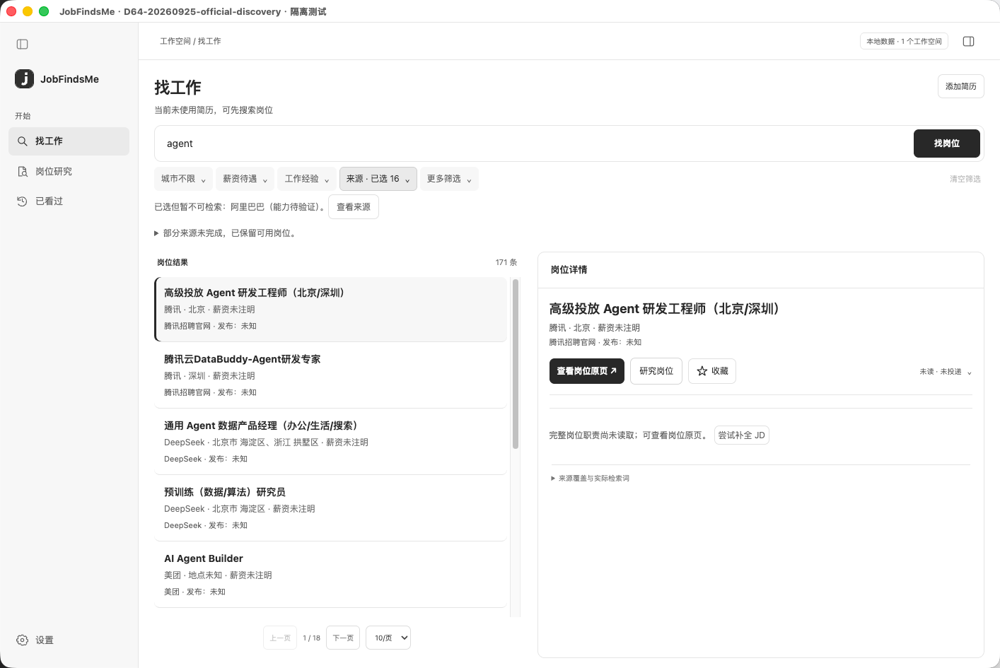
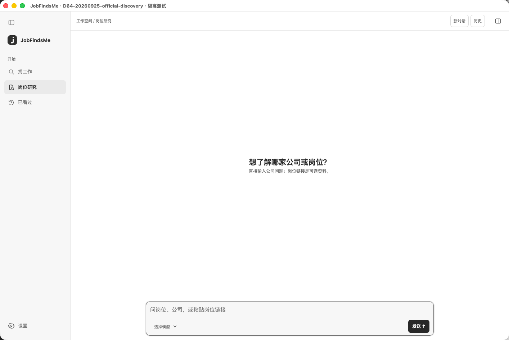

<p align="center">
  
</p>
<h1 align="center">JobFindsMe</h1>
<p align="center"><strong>找岗位，读原文，做研究。</strong></p>
<p align="center">检索 4 个招聘平台 + 16 家公司官网，带着简历找机会，带着证据做判断。</p>

<p align="center">
  <a href="https://github.com/russeell/jobfindsme/releases/latest"></a>
  <a href="LICENSE"></a>
  
</p>

<div align="center">

[下载 macOS 版](https://github.com/russeell/jobfindsme/releases/latest) · [支持来源](#支持的来源) · [快速上手](#开始使用) · [English](README.en.md)

</div>

<br>

<p align="center">
  
</p>
<p align="center"><sub>实际应用截图 · 隔离版本中的一次检索，岗位数量与来源状态仅代表截图时的结果。</sub></p>

## 从找到机会，到了解机会

<table>
<tr>
<td width="33%" valign="top"><h3>01 · 找到岗位</h3><p>按岗位、技能和城市检索多个招聘来源。也可以导入并确认简历，让经历参与匹配。</p></td>
<td width="33%" valign="top"><h3>02 · 了解机会</h3><p>打开招聘原页，继续追问公司与职位。研究回答保留引用，没查到的信息明确说明。</p></td>
<td width="33%" valign="top"><h3>03 · 留下进展</h3><p>收藏感兴趣的岗位，记录已读与投递状态。重开历史对话，接着上次的问题往下聊。</p></td>
</tr>
</table>

## 支持的来源

目前提供 **20 个岗位检索来源：4 个招聘平台和 16 家公司招聘官网**。

| 招聘平台 | 使用方式 |
| --- | --- |
| BOSS直聘 | 在应用内登录并完成来源检查后检索 |
| 猎聘 | 可尝试公开岗位检索，无需预先登录 |
| 智联招聘 | 在应用内登录并完成来源检查后检索 |
| 前程无忧 | 在应用内登录并完成来源检查后检索 |

| 公司招聘官网 | | | |
| --- | --- | --- | --- |
| 腾讯 | 字节跳动 | 阿里巴巴 | 美团 |
| 百度 | 京东 | 网易 | 快手 |
| 小米 | 滴滴 | 拼多多 | DeepSeek |
| MiniMax | 智谱 | 月之暗面 | 阶跃星辰 |

来源是否能返回岗位、读取完整 JD 或继续翻页，以「设置 → 岗位来源」的检查结果为准。登录失效、验证码、限流和网站改版可能影响检索；这份列表不代表所有来源随时可用，也不代表能获取全部在招岗位。

## 安装

从 **[GitHub Releases](https://github.com/russeell/jobfindsme/releases/latest)** 下载桌面安装包。

| 系统 | 当前安装包 |
| --- | --- |
| macOS · Apple Silicon（M 系列） | 下载 `mac-arm64.zip`，解压后将 `JobFindsMe.app` 放入「应用程序」 |
| macOS · Intel / Windows / Linux | 暂未提供安装包 |

当前 macOS 包尚未签名、公证，首次打开可能被系统拦截，请按「系统设置 → 隐私与安全性」提示处理。发布页提供 SHA-256 校验文件。后续可在应用的「设置 → 版本更新」检查新版本并前往下载；暂不自动安装。

如果你用过隔离测试版，原有数据仍留在原测试目录，不会自动合并到正式版。

## 开始使用

1. **选来源。** 打开「设置 → 岗位来源」，按需登录并检查，再勾选要检索的平台或公司。
2. **找岗位。** 回到「找工作」，输入如 `Python 后端`、`Agent 开发`，设置城市等筛选条件。想用简历匹配，可先通过简历按钮导入并确认内容。
3. **看详情。** 打开感兴趣的岗位，核对 JD 和招聘原页，收藏值得继续了解的机会。
4. **做研究。** 在「设置 → 模型设置」配置模型，再进入「岗位研究」提问，或从岗位详情带入研究对象。

可以这样问：

> 帮我了解腾讯的经营与公开披露情况。
>
> 这个岗位主要要求哪些能力？结合 JD 说明。
>
> 刚才的结论有哪些原文支持？还有哪些信息没有查到？

<p align="center">
  
</p>
<p align="center"><sub>一个输入框，从公司、问题或岗位链接开始。选择模型后，即可发起对话。</sub></p>

## 数据与模型

岗位、简历、对话和报告保存在本机，模型密钥使用系统安全存储。聊天和研究使用你配置的模型服务，相关输入会发送给该服务，并可能产生费用；本地保存不等于全程离线。网页检索也需要联网，请勿把隐私信息写进公开检索问题。

支持导入 PDF、DOCX、Markdown 和 TXT 简历，扫描 PDF 暂不支持 OCR。应用不会自动投递，定时检索目前停用。研究报告保留来源与引用，帮助你核对信息；来源可能过时，引用也不等于结论一定正确。

<details>
<summary><strong>开发者 · 从源码运行</strong></summary>

需要 Python 3.11+、Node.js/npm 和 Git。当前桌面开发流程以 macOS 为主。

```bash
git clone https://github.com/russeell/jobfindsme.git
cd jobfindsme
python3 -m venv .venv
source .venv/bin/activate
python -m pip install -e ".[dev,browser]"
cd apps/desktop
npm ci
npm run build
npm start
```

默认使用仓库内的 `.venv/bin/python`，其他解释器可通过 `JFM_PYTHON` 指定。

</details>

## 参与开发

项目使用 Electron、React、TypeScript、Python 和 SQLite，研究对话基于 Pi Agent。欢迎通过 [Issues](https://github.com/russeell/jobfindsme/issues) 反馈问题或提交改进；反馈来源异常时，请附上来源名称、操作步骤和错误提示，不要上传密钥、Cookie 或个人简历。

[贡献指南](CONTRIBUTING.md) · [项目结构](docs/desktop/STRUCTURE.md) · [开发说明](docs/desktop/README.md) · [当前进度](docs/desktop/HANDOFF.md) · [安全说明](SECURITY.md)

## 许可证

[MIT](LICENSE) · Copyright © 2026 Russell。第三方依赖保留各自许可证。
