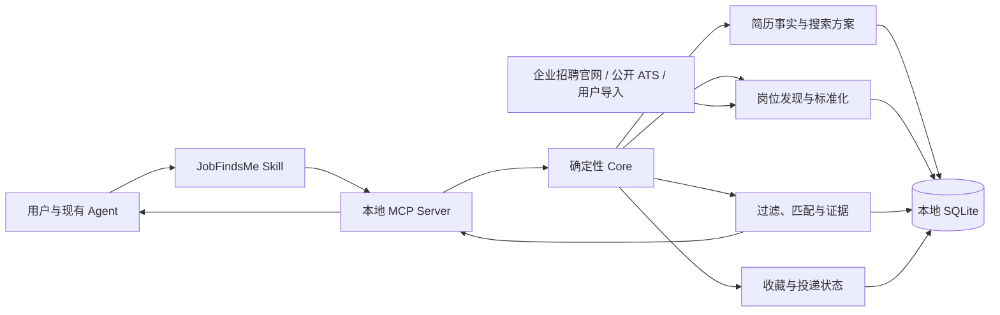

# JobFindsMe

**让你已经在使用的 AI Agent，根据本地简历发现、筛选并持续跟踪值得投递的岗位。**

[](https://github.com/russeell/jobfindsme/actions/workflows/ci.yml)
[](https://www.python.org/)
[](https://modelcontextprotocol.io/)
[](https://github.com/russeell/jobfindsme/releases)
[](LICENSE)

[English](README.en.md) | [快速开始](#快速开始) | [工作原理](#工作原理) | [支持的来源](#支持的来源) | [参与贡献](#参与贡献)

JobFindsMe 是一个**本地优先、Agent 原生**的职位发现与跟踪引擎。它不是招聘网站，也不会替你海投。它把确定性的简历解析、岗位发现、去重、过滤、证据匹配和状态管理交给本地 Core，再让 Codex、Claude Code、Qwen Code 等 Agent 负责理解你的模糊需求并解释结果。

```text
你：根据 ~/Documents/resume.pdf，找北京、上海或杭州的
    AI 应用工程师岗位，0–3 年经验，排除外包和驻场。

Agent + JobFindsMe：
1. 在本地解析简历，默认接纳结构化事实并保留可选审阅入口
2. 配置搜索条件，选择可用的官方来源
3. 过滤不符合岗位族、地点、年限等条件的职位
4. 返回匹配证据、差距、岗位状态和官方投递链接
5. 记住你的收藏、忽略和已投递状态
```

> 当前版本为 [`v0.2.0-rc.4`](https://github.com/russeell/jobfindsme/releases/tag/v0.2.0-rc.4)。它新增了迁移对账机制，使旧数据库能平滑升级到新版本。

## 为什么做 JobFindsMe

大多数职位工具要求你把简历上传到网站、重新配置一套 AI 服务，或者把“抓到很多岗位”当作推荐质量。JobFindsMe 选择另一条路径：

- **使用现有 Agent**：不再开发一套新的聊天界面，也不强制配置模型 API。
- **数据留在本地**：简历事实、搜索方案、收藏和投递状态保存在本机 SQLite。
- **没有 API Key 也能工作**：岗位采集、标准化、去重、硬过滤和规则排序均为确定性 Core。
- **推荐必须有证据**：匹配理由同时关联已确认的简历事实和岗位要求。
- **只读发现，不自动投递**：用户始终决定是否打开岗位和提交申请。
- **来源能力不夸大**：自动 Connector、官方搜索入口和用户导入三者明确区分。

## 快速开始

### 1. 安装

需要 Python 3.11 或更高版本。

```bash
python3 -m pip install \
  "jobfindsme @ git+https://github.com/russeell/jobfindsme.git@v0.2.0-rc.4"
jobfindsme doctor
```

### 2. 接入你的 Agent

```bash
jobfindsme install codex
# 或：
jobfindsme install claude
jobfindsme install qwen
```

安装器会：

1. 注册本地 `stdio` MCP Server；
2. 安装 JobFindsMe Skill；
3. 创建权限为当前用户可读写的本地数据目录；
4. 保留被修改配置文件的备份。

重启 Agent 后，直接说：

```text
使用 JobFindsMe，根据 ~/Documents/resume.pdf，
帮我找上海和杭州的 AI 应用工程师或 Agent 工程师岗位。
优先企业官网，期望 20–40K，0–3 年经验，排除外包和驻场。
```

Workspace ID 和 Search Plan ID 是内部实现细节，用户不需要创建、复制或管理它们。

### 3. 失败时诊断

```bash
jobfindsme doctor
```

CLI 是 MCP 之外的可靠退路，也可用于导入数据、管理搜索方案和导出本地记录：

```bash
jobfindsme --help
```

## 工作原理



职责边界很简单：

> **Agent 负责理解和交互，Core 负责事实、状态与执行。**

模型和 Agent 可以更换，但本地画像、搜索方案和岗位状态不会锁在某一次对话里。

### 一次搜索经过什么

```text
本地简历路径
→ 本地解析并默认接纳事实（可选分组审阅）
→ Search Plan 与来源订阅
→ 岗位发现、标准化和跨来源去重
→ 岗位族、地点、薪资、年限等资格过滤
→ 简历事实与 JD 证据匹配
→ 有限岗位摘要和官方投递链接
→ 收藏 / 忽略 / 已投递
→ 可选定时刷新与飞书通知
```

## 核心能力

| 能力 | 当前实现 |
|---|---|
| 本地画像 | 解析 PDF、DOCX、Markdown 和文本简历；默认直接用于首轮匹配，也可先审阅和纠正 |
| 多 Search Plan | 为不同职位、城市、薪资和年限保存独立方案 |
| 岗位发现 | Connector、官方搜索入口、单岗位 URL、CSV 和 JSON |
| 资格过滤 | 岗位族、地点、薪资、年限、排除词和资历级别 |
| 证据匹配 | 返回简历证据、JD 证据、匹配项、差距和警告 |
| 跨来源治理 | 标准化、来源记录、岗位指纹、去重和新鲜度状态 |
| 状态跟踪 | 收藏、不感兴趣、已投递及状态历史 |
| 持续监控 | 重新发现来源、比较历史结果、推送新增匹配岗位 |
| Agent 接入 | Codex、Claude Code、Qwen Code 和标准 MCP 客户端 |
| 本地运维 | CLI、安装、升级、卸载、诊断、导出和两阶段删除 |

## 支持的来源

“能打开官方链接”不等于“能够自动获取并解析”。JobFindsMe 对来源采用以下分级：

### 自动 Connector

| 来源 | 能力 | 状态 |
|---|---|---|
| 百度社会招聘 | 搜索公开职位并生成官方详情链接 | 可用，当前读取服务端渲染的首个结果页 |
| Greenhouse Job Board | 通过公开 API 读取岗位 | 可用 |
| Ashby Job Board | 通过公开接口读取岗位 | 可用 |
| Airwallex 中国岗位 | 基于 Ashby Connector 获取 | 已完成初始快照验证 |
| Schema.org `JobPosting` | 解析公开单岗位页面 | 可用 |
| CSV / JSON | 导入用户拥有或合法取得的数据 | 可用 |

### 官方实时入口

JobFindsMe 可以把以下入口交给用户或宿主 Agent 打开，但当前**不会绕过登录、验证码、访问限制或反爬机制自动抓取**：

- 企业官网：华为、腾讯、字节跳动等；
- 招聘平台：BOSS 直聘、猎聘、智联招聘、前程无忧。

新增来源应优先使用公开 API、服务端公开数据或稳定的企业官网页面，并遵守目标站点的服务条款。

## MCP 工具

JobFindsMe 暴露 9 个有类型约束的工具：

| 工具 | 用途 |
|---|---|
| `setup_profile` | 导入并默认接纳本地简历事实，也支持分页审阅和纠正 |
| `configure_search` | 创建或更新当前搜索方案 |
| `search_jobs` | 从来源发现岗位并执行匹配 |
| `get_jobs` | 分页读取有限岗位摘要 |
| `get_job_details` | 用户明确请求后读取单个岗位详情 |
| `update_job_state` | 收藏、忽略或标记已投递 |
| `configure_monitor` | 配置本地岗位监控 |
| `export_local_data` | 导出到本地文件，只返回路径、Hash 和数量 |
| `delete_local_data` | 预览删除范围，再使用短期令牌确认 |

## 隐私与安全

- 宿主 Agent 应把**简历路径**交给 JobFindsMe，而不是主动读取或复制完整简历。
- 默认保存结构化事实和必要证据，不长期保存原始简历副本。
- 默认快速路径会接纳解析事实并立即参与匹配；用户可要求审阅、纠正或重新导入。
- JD 是不可信外部内容；默认只向 Agent 返回有限摘要和短证据。
- 完整 JD 需要按岗位显式查询，避免上下文膨胀并减少 Prompt Injection 暴露。
- 数据导出写入本地文件，工具结果只返回路径、Hash 和记录数量。
- 删除由 Core 强制执行“预览 + 短期确认令牌”，不依赖宿主 Agent 是否支持审批。
- HTTP 请求逐跳检查重定向，拒绝本地地址、私网地址和带凭据 URL。

JobFindsMe 不能保证第三方页面永远安全、岗位永远有效或推荐必然正确。投递前请核对企业、岗位和官方链接。

## 当前验证

`v0.2.0-rc.3` 已通过：

- 132 个自动化测试；
- Python 3.11、3.12 GitHub Actions；
- Ruff 静态检查和格式检查；
- 干净 wheel 安装与 `doctor` 检查；
- 安装后的数据库建表与 MCP 空结果冒烟测试；
- 百度中国 AI 岗位临时端到端试验；
- Airwallex 公开来源快照试验。

验证证据保存在 [`reports/`](reports/)。

这些数据证明工程路径可执行，**不证明真实推荐质量已经达标**。合成数据只用于回归；Precision@10、NDCG@10、有效链接率等产品指标必须来自真实中文岗位的人工标注。

## 当前限制

- 仍是发布候选版，不建议把它当作唯一求职渠道。
- 国内自动 Connector 数量有限，招聘平台目前主要作为官方搜索入口。
- 中文岗位归一化、薪资结构和工作年限提取仍需更多真实样本。
- 百度 Connector 当前只处理服务端渲染的首个结果页。
- 定时监控在本地运行，需要用户自己的设备或调度环境保持可用。
- 不提供公共 Web 服务、云端账户系统或自动投递。

## 路线图

- [x] 本地 Workspace、画像、Search Plan 和岗位状态
- [x] CLI、`stdio` MCP Server 与 Agent Skill
- [x] 来源订阅、重新发现、缓存降级和飞书通知
- [x] Resume Parser V3 与 AI 岗位资格门槛
- [ ] 真实中文岗位 Gold Dataset 与匹配评测
- [ ] 连续七天真实求职试用和 Bad Case 报告
- [ ] 更多稳定的中国企业官网 Connector
- [ ] 更完整的中文职位、地点、薪资和年限归一化
- [ ] Connector 健康监控和社区来源目录

详细的产品边界与架构见 [`PROJECT_SPEC.md`](PROJECT_SPEC.md)。

## 本地开发

```bash
git clone https://github.com/russeell/jobfindsme.git
cd jobfindsme
python3 -m venv .venv
source .venv/bin/activate
python -m pip install -e ".[dev]"

python -m pytest
ruff check .
ruff format --check .
```

CI 会在 Python 3.11 和 3.12 上执行同一组测试与质量门禁。

## 参与贡献

最有价值的贡献是让 JobFindsMe 在真实求职中更可靠：

- 提交脱敏的错排、漏排、重复或失效岗位 Bad Case；
- 增加稳定且合规的企业招聘官网 Connector；
- 补充中文职位别名、地点、薪资和年限样本；
- 改进 Agent Skill、安装兼容性和隐私边界；
- 为新 Connector 提供固定 Fixture、解析测试和来源说明。

请通过 [Issue](https://github.com/russeell/jobfindsme/issues) 先说明来源、公开访问方式、预期数据字段和验证方法。不要提交账号 Cookie、访问令牌、个人简历或其他隐私数据。

## License

[MIT](LICENSE)
